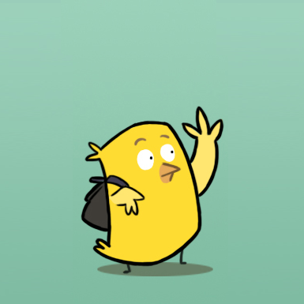
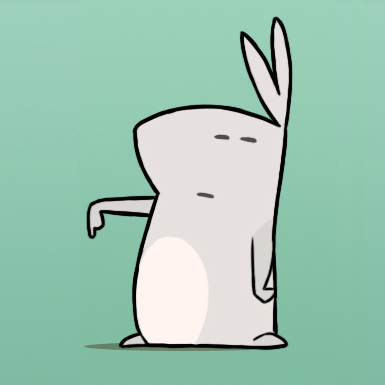

# Bill Bunny

## Overview

Bill Bunny was a prototype web app to split household bills amongst flat-sharers.

It was born out of a solid need from my own experiences of flat-sharing, and extensive research, surveys and analysis of said surveys to discover what flat-sharers actually want and need.

## Branding

Bill Bunny and the other characters are a metaphor for the situation all house sharers find themselves in with managing bills, splitting payments, and living with one another in a harmonious house-sharing bliss.

### Flat Bunnies

The Flat Bunnies represent **flat mates**.

They’re loads of fun, not so brilliantly-organised, and love partying, and having a good time. When not burning the candle at both ends, their life revolves around carrots, which in their world equates to **cash**.

### Bill Bats

The Bill Bats represent the monthly onslaught of **bills**.

The bats, although vampires, are vegetarian, hungry for the **carrots** (it’s a visual pun: orange/red, geddit?) and will do anything they can ravage the bunnies’ prized root vegetables!

### Couch-Surfing Bird

Couch-Surfing Bird represents new flatmates, or long-staying **antipodean** visitors.

These birds are even less organised than the bunnies, use all the utilities, leave the lights on, and always drink the last of the milk, never replacing it! (Don’t you know [about the bird](https://youtube.com/watch?v=ho17gqToEWA) ?)

### Bill Bunny

Bill Bunny is the **Zen-Master** of bills, bringing order to the chaos that is the bunnies’ lives.

He has all the tools, techniques, know-how and knowledge to make everybody’s lives happier, cheaper, and more fulfilled.

Together, the bunnies, bats and birds co-exist in perfect (but comic) disharmony, with Bill effortlessly and elegantly providing solutions to their everyday mishaps.

## Implementation

The alpha site was built as an MVC PHP application using Kohana 2.3, but will likely be transitioning to a single-page Ember application, for a more fluid, app-like experience.

As well, a lot of the back-end view manipulation / logic will be moved client-side, with only routing and database-critical functionality to stay on the server-side.

## Links

- [Bill Bunny](http://billbunny.com/)
- [Bill Bunny blog](http://blog.billbunny.com/)
