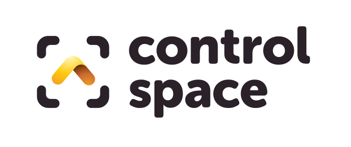

# Bio

I'm one of those annoying people who ***love*** their job.

I'm constantly thinking of ways to build things, to connect things, how it could be better, or easier, or smoother, or cooler. Shower thoughts become notes, sketches, experiments, repos, releases, then... 

<Quote text="Woohoo!!" name="Me, cracking the latest big / small idea" size="2" hero />

You see where I'm coming from?

I've had an interesting journey through tech; my background is animation and I learnt to code in 3dsmax, After Effects and Flash – in what used to be a very creative TV and advertising agency landscape.

After Flash died a death, and Web 2.0 matured, ActionScript became JavaScript, MaxScripts became NPM packages, and micro-sites became Vue applications.

There's been a mix of front end, back end and languages along the way, but right now Node, TypeScript & Vue is my stack, with a preference for frontend, static sites, tooling and extensions. 

I've worked freelance, in teams, in small, medium and enterprise-sized companies, on short, medium and multi-year projects as what you might call a senior / lead dev.

Right now I'm focusing on the Indie Hacker dream; releasing my own software and hopefully growing it into a sustainable business.

Moving from developer to consumer / business tools is an interesting one; I've still a lot to learn, and it's too early to make any predictions, but [Control Space](https://controlspace.app) has recently gone into public Beta  🥳. 

You can find me / my work / my comments / my likes on
[GitHub](http://github.com/davestewart/) /
[Gists](http://gist.github.com/davestewart),
[LinkedIn](http://linkedin.com/in/davestewartuk),
[Reddit](http://reddit.com/user/dave__stewart),
[Meetup](http://meetup.com/members/5200599/),
[Product Hunt](http://producthunt.com/@dave_stewart),
[Indie Hackers](http://indiehackers.com/likelylogic),
[Stack Overflow](http://stackoverflow.com/users/1715497/davestewart),
[CodePen](http://codepen.io/davestewart/),
[Vue Forum](http://forum.vuejs.org/u/davestewart/),
[Mixcloud](http://mixcloud.com/davestewart/),
[SoundCloud](https://soundcloud.com/davestewart/likes) and [Vimeo](http://vimeo.com/davestewartuk).

If you fancy a two-way conversation, catch me on
[Twitter](http://twitter.com/dave_stewart).

