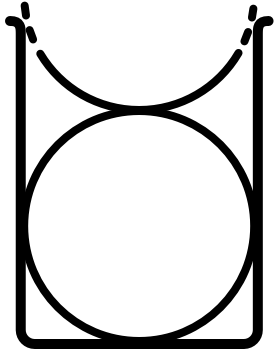
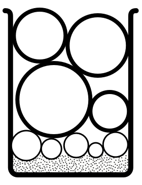

## Intro

There's a well-known story (which can be seen on [YouTube](https://www.youtube.com/watch?v=SqGRnlXplx0)) about a professor who teaches his class a life lesson by putting rocks, pebbles and sand into a jar in a particular order.

The idea is that by considering the things in your life as rocks, pebbles and sand, you can formulate a way to fit everything in to bring you fulfilment and happiness.

It's a lovely analogy; the problem is that rocks, pebbles and sand don't translate 1:1 as a productivity strategy.

However, if you *turn the theory on its head*, you can get some value out of it.

### How the story explains it

The rocks are meaningful things in life, like health, family and relationships, and should be put in **first** (we're told if you put them in last, there'll be no room for them at the end).

The pebbles are the other things that matter such as work, or school, and these should fill the gaps between the meaningful things.

The sand is the small stuff, like possessions or social media, and should only be added at the end to fill the remaining space.

### What happens in real life

For most hardworking folks, the **rocks** end up being **work** and on an average day, they’re gonna go in **first**.

The problem is that work can be all-consuming, and because humans are poor at multi-tasking you end up working every hour of the day (and possibly evening), and everything else slips.

At the end of the week or month, you look back and realise you never got to the pebbles (planning that holiday) or sand (booking that doctor’s appointment) and it’s costing you health, satisfaction and happiness.

### Turning the idea on its head

Rather than letting work swallow-up your days, commit to **time-boxing** only **some** small and medium personal tasks per day, **first**!

Begin with 15 - 30 minutes of trivial to-dos, the kind which take only a few minutes.

Spend the next 60 - 90 minutes on medium tasks you know you know you can get done.

Once these are done, not only will you get a huge boost of satisfaction, but you are free to disappear down the rabbit hole of chunky work tasks for the rest of the day!

When you look back at your week you’ll have accomplished tasks in all areas of your life, and be happier and more organised for it :)
