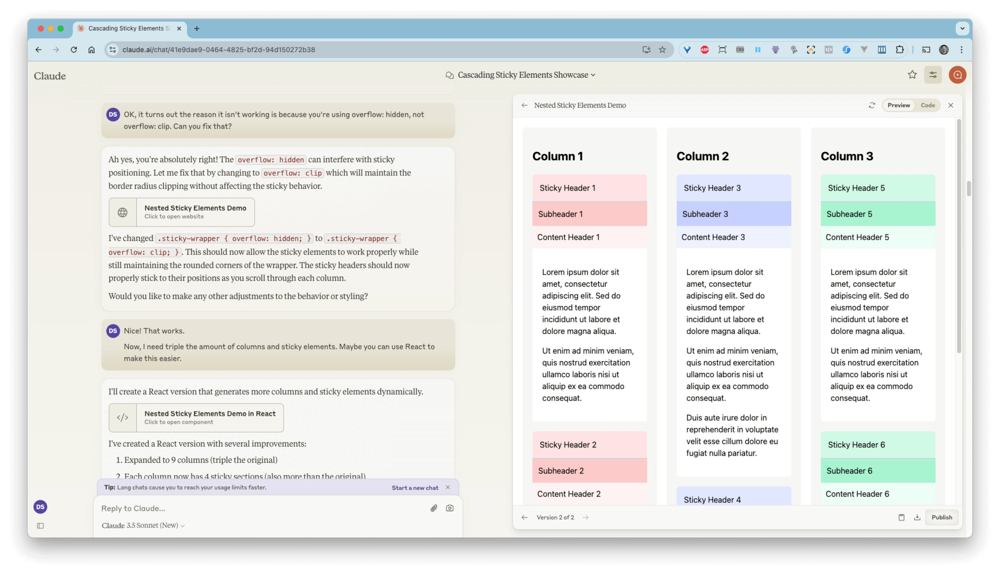

# How do AIs code as well as they do?

Coding with help from AI has become a critical part of my daily workflow. It can iterate on problems much faster than I can physically research, plan, type and debug by myself, and can teach me new techniques I may not even be aware of.

But I wondered how _does_ AI write such good code, even considering small details I might miss on the first iteration, and often even making tasteful design decisions? Well... rather than Googling for the answer, I just asked Claude itself!

What follows is a brief conversation I had with the AI, asking it just how it writes such good code. Its answers surprised me, but deepened my understanding of the process it takes, equipping me to help it help me more quickly in the future.

_**Note:** I have edited some of the replies for clarity._

## Transcript

#### ***DS:*** How do AI models write such good code, and intuit some of the hidden steps?

***Claude AI:*** Let me break this down carefully, as it's a fascinating question. AI models like myself don't actually "understand" code or problem-solving in the way humans do. Instead, we're pattern matching systems working with probability distributions across a vast parameter space.

Think of it like this: during training, an AI model sees billions of examples of code, problem solutions, and explanations. When writing code or solving problems, we're not really "thinking" - we're recognizing patterns and generating responses based on statistical regularities in our training data.

Let me give a concrete example. When I write code to sort a list, I'm not inventing the algorithm from first principles. Instead, I'm drawing on patterns I've seen of:
- How sorting problems are typically structured
- Common Python syntax and conventions
- Ways to explain code step-by-step
- Typical edge cases and error handling

The "hidden steps" that seem intuitive often emerge from this statistical pattern matching. I might add input validation not because I truly understand why it's needed, but because I've seen that pattern consistently in well-written code.

This is why AI models can sometimes make basic logical errors or generate nonsensical code - we're not reasoning from first principles, but rather synthesizing patterns in ways that usually (but not always) work.

#### ***DS:*** So when a human points out a problem, how do you change your internal model?

***Claude AI:*** Actually, I don't have the ability to change my "internal model" at all based on corrections. I have no memory between messages and cannot learn or update from interactions. Each response I give is generated fresh, without any knowledge of previous exchanges except what's visible in our conversation history.

When a human points out a mistake in something I've written, I can acknowledge that mistake and provide a correction in my next response, but this is simply me generating a new response given the additional context of being told about the error. I'm not actually "learning" or updating any internal representations.

This is a key limitation of current AI systems like myself - we don't have true learning capabilities during conversations. While humans can form new neural connections and update their understanding through interaction, my parameters remain fixed. I can only work with the patterns I learned during my initial training.

Think of it like this: I'm more like a very sophisticated autocomplete system than a learning agent. I can generate contextually appropriate responses, but I can't form new memories or update my knowledge base through our interaction.

This is why you might see me make the same mistake again in a future conversation - each interaction starts fresh, without any memory of previous corrections or learning from past errors. Everything I "know" comes from my initial training, not from interactions with humans.


#### ***DS:*** So there is no model, just updated "context"?

***Claude AI:*** Exactly right. I have a fixed model from my training, but during our conversation, the only thing that changes is the context window of our discussion.

Think of it like having a massive, but unchangeable, lookup table of patterns (that's a vast oversimplification, but it helps illustrate the point). When you point out a mistake, what changes isn't the lookup table - instead, the new context of "Oh, that previous thing was wrong" becomes part of the input that I use to generate my next response.

An analogy might help: Imagine a GPS system with a fixed map. When you tell it "that route was wrong, there's construction," it doesn't update its underlying map. Instead, it just uses that new information as a temporary constraint to generate a different route for this specific trip. The next time you ask for directions, it starts fresh with its original map.

Similarly, my responses might improve within a single conversation as more context is added, but this isn't because I'm learning - it's because I have more relevant information in the immediate context to work with. The next time someone starts a new conversation with me, I'll be starting fresh with my original training, without any of the corrections or refinements from previous conversations.


#### ***DS:*** So this context is spread across many comments. Do you re-parse all those comments each time, or hold an internal model of them as some kind of combined context?

***Claude AI:*** For each new response, I re-parse our entire conversation history - there's no persistent "combined context" or summary that I maintain between responses. 

Each message you send triggers a fresh analysis of _everything_ that's been said, from _both_ parties, from the first message to the latest. This includes:

1. Your questions and statements
2. My previous responses
3. Any code or examples shared by either of us
4. Any corrections or clarifications made along the way

This is actually why you might sometimes see me being quite precise in referring to things we discussed earlier - I'm not pulling from a maintained summary, but rather re-reading and re-analyzing the entire conversation each time.

This design has both advantages and limitations:

- Advantage: Each response considers the full context very thoroughly
- Limitation: It's computationally intensive to re-process everything each time
- Advantage: No risk of context getting corrupted or summarized incorrectly over time
- Limitation: Can't maintain any kind of evolving understanding or intermediate state

This is also why you might notice that if our conversation gets very long, I might start to lose access to earlier parts of the conversation - there's a maximum amount of context I can process at once (my "context window"). When that limit is reached, earlier messages effectively fall out of view.

Think of it like reading a long email thread - each time you reply, you re-read the whole thread from the top, rather than working from some summary you've maintained in your head. That's essentially what I'm doing with each response.


#### ***DS:*** In that case then, would it sometimes be better to start a new conversation so you are not confused by earlier assumptions and misunderstandings?

***Claude AI:*** Yes, that's a really insightful observation! There are definitely cases where starting fresh can be better, particularly when:

1. We've realized there was a fundamental misunderstanding early in the conversation that colored subsequent responses
2. The conversation has wandered far from the main topic and we want to refocus
3. We've hit or are approaching my context window limit and earlier important details are at risk of being dropped
4. The problem we're working on has evolved significantly from our initial approach

It's similar to how sometimes in a human conversation, it's better to say "Let's start over" rather than trying to untangle a series of misunderstandings or keeping track of too many previous caveats and conditions.

However, there are also times when maintaining the conversation history is valuable:
- When building on iterative work (like refining code or writing)
- When the context includes important specifications or requirements
- When previous examples or explanations are relevant to current questions


#### ***DS:*** So, back to the original topic; how do you generate the code itself?

***Claude AI:*** When generating code, I'm essentially performing several types of pattern matching simultaneously across the code I've seen in training. Let me break down how a typical request gets turned into code:

1. First, I identify the type of task from your description by matching it against similar problem descriptions I've seen:
    - Direct requests ("write a function that sorts a list")
    - Problem descriptions ("I need to process these files")
    - Higher-level goals ("create a web dashboard")

2. Then I match core components needed for this type of task:
    - Common function signatures for this problem type
    - Typical variable names and structures
    - Standard libraries or frameworks usually used
    - Common patterns and idioms

3. During generation, I'm constantly doing probabilistic prediction of:
    - What code statement typically follows the previous one
    - What variable names make sense in this context
    - What edge cases typically need handling
    - What docstrings or comments are appropriate

For example, if you ask me to "write a function to find duplicate files," I'll recognize this as a file system task, which typically involves:

```python
import os  # Because file system tasks usually need os
from pathlib import Path  # Modern Python often uses pathlib
import hashlib  # File comparison often uses hashing

def find_duplicates(directory):  # Common function signature pattern
    file_hashes = {}  # Common pattern: dict for tracking duplicates
    # ... rest of implementation
```

Each line generates based on what commonly follows in similar code patterns, while maintaining consistency with the overall task context.


#### ***DS:*** So do you have lines of code in a database, or is it more abstract than that?

***Claude AI:*** I don't actually have a database of code lines or even explicit rules. Instead, I have what's called a neural network with weights (parameters) that encode patterns in a highly abstract, distributed way.

Think of it like this: rather than storing "if you see X, write Y code", the network encodes statistical relationships between concepts, syntax, and patterns across many dimensions. It's more like having a deep understanding of the "shape" of different programming concepts and how they fit together.

When you ask about code, these patterns activate in complex ways. For example, when generating a Python function:
- The concept of "function" activates patterns about function syntax (def, indentation, return)
- The problem domain activates patterns about relevant libraries and approaches
- The variable names emerge from patterns of what names make sense in this context
- The logic flow emerges from patterns of how similar problems are typically solved

So rather than looking up "how to write a for loop", it's more like the entire context of your question activates a complex set of interconnected patterns that guide the generation of each token (word/symbol) based on what came before.

This is why I can write novel code that I've never seen exactly before - I'm not copying from examples but rather synthesizing from abstract patterns of how code is structured and how different programming concepts relate to each other.

This is also why I can sometimes make subtle logical errors - I'm not executing the code or truly understanding it in a computational sense, I'm generating based on statistical patterns of what "looks right" in this context.


#### ***DS:*** So given all of the above, would you say you're smart, or actually quite dumb? (Perhaps that's an unfair comparison, comparing apples to oranges).

***Claude AI:*** That's a fascinating philosophical question! I think you're right that it's an apples-to-oranges comparison. I'm neither "smart" in the way humans are (with true understanding, learning, and consciousness) nor "dumb" in the sense of being simple or mechanical.

What I am is a highly sophisticated pattern matching system. I can process vast amounts of information and generate contextually appropriate responses, but without the deep understanding or adaptability that characterizes human intelligence.

Think of it like this: I'm like a mirror that can reflect and recombine human knowledge in useful ways, but I don't generate truly new understanding or develop my own insights. I can appear very "smart" when the patterns align well with the task at hand, but can also make surprisingly basic errors that any human would catch - because I'm matching patterns, not truly reasoning.

To use a different analogy: a calculator is neither "smart" nor "dumb" - it's just very good at its specific type of pattern processing. I'm similar, just operating on language and concepts rather than numbers.

This is why I think the most accurate way to think about AI systems like myself is as a new kind of tool - different from both human intelligence and simple computing, with its own unique strengths and limitations.

## Summary

So to summarise, here's what I discovered:

- LLMs do not actually "understand" the code they are writing; it's more of a best-fit between the entire context (our conversation) and patterns encoded in neural network weights (from the training data)

- LLMs don't "modify a mental model" as you converse; rather for each update they re-process the entire context from scratch, generating a new response, unrelated to any previous responses, each time

- LLMs do not actually "reason" like humans do, rather they are fine-tuned to find relevant patterns from a huge, curated set of training data

- LLMs don't store "lines of code"; rather they predict each token based on relevant programming patterns they have been trained on

Given the above, it's become clearer to me that AI – or in this case LLMs – do not have the capability to reason, intuit, or adapt their mental model like I thought they did. Rather, the _context_ is what changes – incrementally narrowing the scope of the training data – and guiding the conversation to a particular outcome. 

And, given this concept of narrowing, things like "Custom GPTs" where a pre-prompt such as "You are a ... with expertise in ... etc, etc" makes more sense; this initial text simply instructs the LLM to narrow its pattern-matching mechanisms to a more targeted subset of training data before the main conversation begins.

## A note about Anthropic Claude

If you have not yet checked out [Claude AI](https://claude.ai/), then you might want to take a look, as in my experience, not only does it write better code than Chat GPT, but it has a superior interface and _crucially_, can even run web code live in the browser.



