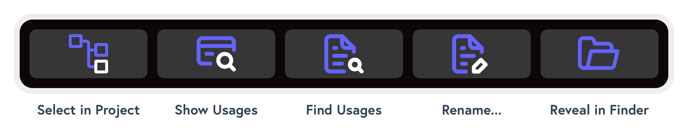
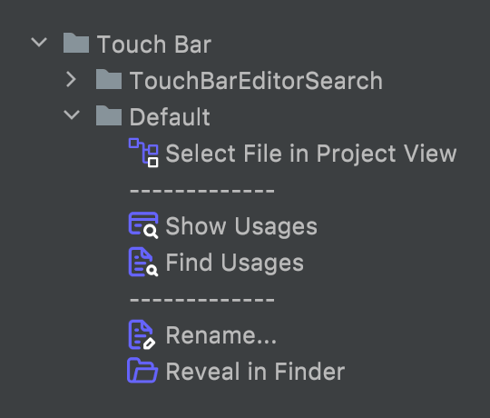

# WebStorm shortcuts for lightning productivity

WorkFlowy is the most powerful web development IDE there is. If you want to match power with speed get your hands on WebStorm's powerful and intuitive keyboard shortcuts.

<NavToc />

## Editing

### Selection

Words

- `Alt` + `double-click` - Select multiple words
- `Ctrl` + `G` - Select next same word (forward)
- `Ctrl` + `Shift` + `G` - Deselect next same word (backward)
- `Ctrl` + `Cmd` + `G` - Select all same word

Regions

- `Alt` + `Up`/`Down` - Expand / reduce selection bounds
- `Alt` + `drag` vertically - Select multiple blocks or starts/ends of lines

Multi-caret operations (video [here](https://www.youtube.com/watch?v=PIqBf7Ekjgk))

- _Start typing to modify text on all lines_
- `Arrow` keys - Move carets
- `Enter` - Add carriage returns
- `Delete` - Remove text
- `Home` / `End` - Jump to home / end on all lines
- `Esc` / `Click` - Clear selection

Modifications once selected

- Type `< ( { [  " '` - Wrap with the corresponding pair, i.e. hit `[` to get `[selection]`

### Clipboard

Multi-caret / range

- `Cmd` + `C` - Copy text / ranges
- `Cmd` + `V` - Paste into / over ranges

Multi-clipboard

- `Cmd` + `Shift` + `V` - Paste recent (shows popup)

### Modification

Formatting

- `Cmd` + `Alt` + `L` - Reformat code
- `Cmd` + `Shift` + `U` - Toggle case

Commenting

- `Cmd` + `/` - Inline comment / uncomment
- `Cmd` + `Shift` + `/` - Block comment / uncomment

Move lines

- `Alt` + `Shift` + `Up`/`Down` - Move line up / down
- `Cmd` + `Shift` + `Up`/`Down` - Move block (statement, element) up / down

Modify lines

- _Place caret anywhere within line then_
- `Cmd` + `C` - Copy line
- `Cmd` + `X` - Cut line
- `Cmd` + `D` - Duplicate selection / line
- `Cmd` + `Backspace` - Delete line

### Tips

- Rename an opening / closing HTML / JSX / XML tag to rename its corresponding pair
- Typing an attribute quote will automatically pair and position the caret, i.e. `attr="` &gt; `attr="<caret>"`
- For mass editing:
  - Look to select patterns, i.e. `: '` or `= [` or `class=`
  - Then `Ctrl` + `G` to select same occurrences
  - Then `Arrows`, `Home`, `End`, expand selection to move around
  - Then start typing, copy and paste, Toggle case, to modify text
  - _You can get real creative!_

## Assistance

### Search

Text

- `Cmd` + `Shift` + `F` - Find text in path
- `Cmd` + `Shift` + `R` - Replace text in path

Symbols

- `Cmd` + `O` - Find class
- `Cmd` + `Alt` + `O` - Find symbol

Files

- `Alt` + `F7` - Find usages (whilst a file is selected)

### Intelligence

Coding assistance

- `Cmd` + `P` - Show function parameters
- `Ctrl` + `Space` - Show completions
- `Alt` + `Enter` - Show intentions

General refactoring

- `F6` - Move file / namespace / function / variable
- `Shift` + `F6` - Rename file / namespace / function / variable

Code refactoring

- `Cmd` + `Alt` + `V` (then `Up` / `Down`) - Extract variable
- `Cmd` + `Alt` + `C` (then `Up` / `Down`) - Extract constant
- `Ctrl` + `T` - Refactor this... _(all these commands and more)_

### Code generation

Live templates

- `Cmd` + `J` - Show available templates, then `Tab` to insert
- Or simply type template key (i.e. `forin`) + `Tab` - Add template with placeholders
  - Use `Tab` to jump between placeholders
- _See all, enable / disable, or add your own via `Cmd` + `,` + type `live`_

Postfix completion

- Type `<expr>.log` + `Tab` - convert expression to `console.log(<expr>)` 
- Type `<expr>.if` + `Tab` - convert expression to `if (<expr>) { ... }`
- _See all, enable / disable, or add your own via `Cmd` + `,` + type `postfix`_

HTML

- `Cmd` + `Alt` + `T` > `T` - Surround with tag _(then type tag name to fill in)_
- `<expr>` + `Tab` - Generate tags using Emmet
  - Use `Enter` to jump between placeholders

## Navigation

### Editor

Code / Markup

- _Works in JavaScript, HTML, CSS, anywhere, and across domains!_ 
- `Cmd` + `Click` symbol name - Go to declaration
- `Cmd` + `Click` declaration - See all usages

Cursor

- `Cmd` + `[` - Go to previous edit point
- `Cmd` + `]` - Go to next edit point

### Project

Files

- `Cmd` + `Shift` + `O` - Open file
- `Cmd` + `Shift` + `N` - Create scratch file

Windows

- `Cmd` + `E` - Show recently opened files
- `Alt` + `F1` - Go to current file in... _(project, explorer, changes, browser, etc)_
- `Ctrl` + `Tab` - Quick-switch editor panes

## Application

### Panels

Search

- `Cmd` + `Shift` + `A` - Find action _(any application command)_
- `Shift` + `Shift` - Find anything _(files, classes, assets, shortcuts, preferences, etc)_

Preferences

- `Cmd` + `,` - Show preferences dialog
- Type anything - Find preference

### Tips

Click any list (Project hierarchy, Code Structure, Find Results, etc) then:

- Start typing to filter / highlight
- Use fuzzy matching, i.e. `pn` to find `[P]age[N]ode`
- Use `/` to disambiguate folders, like `s/c/app`

Shortcuts

- Every shortcut can be changed!
- Change shortcuts for plugins via **"Keymap > Plugins > [Plugin Name]"**

## Touchbar

### Custom touchbar icons

For touchbar Macs, unfortunately it's impossible to use the F-keys mentioned above, so instead you can configure touchbar icons and use the touchbar instead.

Click below to download:

Thanks to [Iconscout](https://iconscout.com/unicons/explore/line) for their excellent free icons got me started with this.

### Configuration

To add the icons:

- Go to **Preferences** > **Appearance & Behavior** > **Menus and Toolbars**
- Choose **Touch bar** > **Default**
- Click the `+` button
- Choose which actions to add

Once done:

- Select each action individually
- Click the `Edit` icon in the toolbar
- Pick the appropriate icon from your hard disk 

#### Debugger touchbar bug

Because of – I'd call it a bug – in WebStorm, if you use the Node Debugger, the debugger touchbar overrides the default touchbar, hiding the project shortcuts.

To fix this, go to the preferences, and simply delete the touchbar folder. Don't worry! The debugger controls are easily available via the main Debugger UI.
