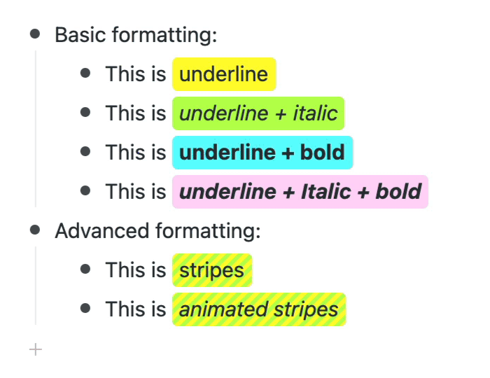

# Hacking WorkFlowy formatting with Stylish

## Intro

As of June 2021 WorkFlowy didn't have any way to colorize text, however using a browser extension called [Stylish](https://chrome.google.com/webstore/detail/stylish-custom-themes-for/fjnbnpbmkenffdnngjfgmeleoegfcffe) and some clever targeting of built-in HTML – it is actually possible – and even has a great UX.

## Implementation

### How it works

WorkFlowy works by rendering the text you enter in `[contentEditable]` elements as pure HTML, with _italic_, **bold** and <u>underline</u> formatting stored in `<i>`, `<b>` and `<u>` tags respectively.

As the underline format is rarely used, we can take some artistic license and reserve the `<u>` tag to be used as a styling _hook_ to implement custom formatting using Stylish.

Additionally:

- combining underline, italic and bold we actually get _four_ possible combinations of formatting
- the user can use the system shortcut keys `Cmd`+`U`, `Cmd`+`I` and `Cmd`+`B` to quickly highlight text

### End result

Once installed and set up, WorkFlowy can look like this:




## Stylesheets

### Basic

Basic highlighting is achieved with the following rules:

```css
:root {
  --pink: #ffd6f7;
  --orange: #ffdf37;
  --yellow: #fffb2f;
  --green: #baff50;
  --blue: #61fdff;
}

.content u {
  padding: 2px 5px 4px;
  text-decoration: none !important;
  border-radius: 4px;
  font-weight: normal;
  font-style: normal;
}

.content u {
  background: var(--yellow);
}

.content i u {
  background: var(--green)
}

.content b u {
  background: var(--blue)
}

.content b i u {
  background: var(--pink)
}
```

### Advanced

More advanced effects can (though almost certainly shouldn't!) be added using more exotic CSS:

```css
@keyframes slide {
  from { background-position: 0 0; }
  to { background-position: 8.49px 0; }
}

.content u {
  background: var(--stripes);
}

.content i u {
  background-image: var(--stripes);
  background-size: 8.49px;
  transition: 1s background;
  animation: slide .5s linear infinite;
}
```

## Setting up Stylish

Install from the [Chrome WebStore](https://chrome.google.com/webstore/detail/stylish-custom-themes-for/fjnbnpbmkenffdnngjfgmeleoegfcffe) then open [WorkFlowy](https://workflowy.com).

On the extension's Action button in the toolbar (or in the extensions dropdown):

- Click the icon to show the popup
- Click the 3-dots at the top
- Click "Create New Style"

In the page that appears:

- Paste the CSS code above into the "Code" panel
- In the "Applies" section, click "Specify"
- Change "URL" to "URLs on the domain"
- Type "workflowy.com" (without the quotes) in the next field

To finish:

- Hit `Cmd` + `S` to save
- Close the tab

Then start underlining!

## Addendum

#### September 2021

WorkFlowy has released [native highlighting](https://blog.workflowy.com/text-and-tag-colors-are-now-available/) so this hack is no longer needed... though the convenience of using system shortcut keys (you can also use `Shift`+`Cmd`+`H`) is not to be underestimated!


#### January 2022

A new project I'm working on takes the idea of hacking WorkFlowy formatting to **a whole new level** by turning WorkFlowy into a [Markdown-compatible word processor](https://twitter.com/dave_stewart/status/1484911995698745347).

I'll release more details as soon as I get time to work on the project again.
