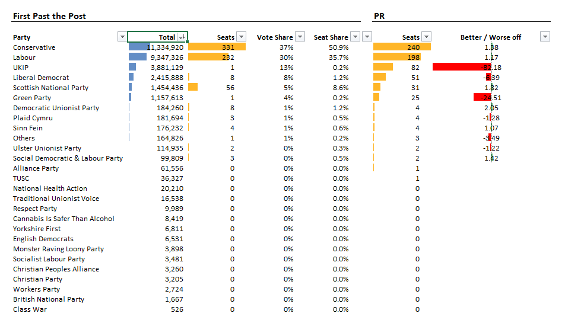
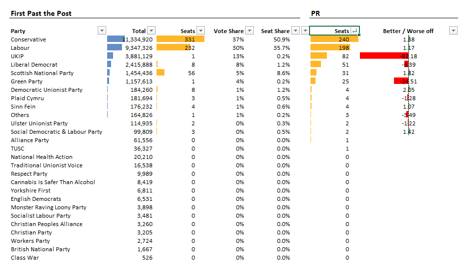
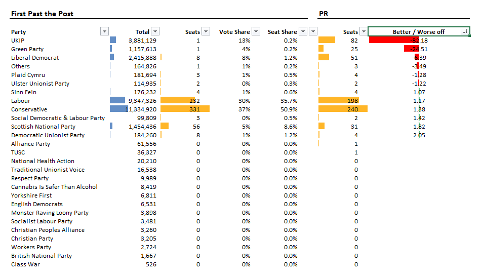

# The wrong kind of democracy?

## Intro

Anyone who knows me, knows I'm into numbers, and I'll not get into a discussion in depth without some kind of analysis of the figures.

There's been a lot of talk over the past few days about votes, PR, and how the current system seems unfair. Just how unfair is subjective depending on how useful you think [each system](http://idea.int/esd/glossary.cfm) of voting actually is.

Apparently First Past the Post (FPTP) is designed to ensure a stable government, that is, not too many views so the majority party can "get on with it" without too many dissenting voices. Although in the UK a coalition is seen as a blip, in Germany, it's seen as the [norm](http://theguardian.com/politics/2015/may/05/britain-weird-electoral-system-uk-general-election-europe) (perhaps we should give the Germans more credit than we do).

## Aims

Anyway, I wanted to know for myself, just how the various parties fared compared to say something which on the face of it sounds fair, like Proportional Representation (PR).

And also to answer other questions, like:

- Why do UKIP, who got 4 million votes, have only one seat?
- Why do the SNP, when Scotland's entire population is only 4 million, get 56 seats?
- Is the proportion of seats available to the Scots fair in relation to their population?
- Why did Labour supposedly do so badly in Scotland?
- Which countries had the best turnout?

To do this, I simply put the figures from the [BBC Election 2015](http://bbc.co.uk/news/election/2015/results) site into a spreadsheet, and did some simple maths.

- **[You can find, and play with the spreadsheet here.](https://onedrive.live.com/redir?page=view&resid=65A55583927C4A01!1087&authkey=!ADPjYchPRCGXdK4)**

Disclaimer: "Dammit Jim, I'm a programmer, not a politician!"

## Figures

::alert{inline icon="info"}
The chart colours are only to help illustrate column types, and nothing to do with parties.
::

Let's start with the UK. Here's all votes, by party _(table ordered by FPTP Total)_:

Now, let's look at how that translated into seats _(table ordered by FPTP Seats)_:

 

Hmm... seats don't correlate to votes, do they?

Let's see how would that have looked under a PR system _(table ordered by PR Seats):_

A huge difference! UKIP have 82, where before they had 1, and the Greens get 25, whereas before they too also had 1.

(Actually, this is exactly the same table / ordering as the first table; votes = seats).

## Analysis

So let's see just how unfair this is _(table ordered by PR Better / Worse off)_:

A few highlights:

- UKIP appear to be about 82 times worse off under FPTP. They netted nearly 4m votes, the 3rd most votes after the Tories and Labour, meaning nearly 1 in 12 people in the UK voted for them. In England, that rises to 1 in 11.
- The Greens were around 25 times worse off, having netted over a million votes. Nearly 1 in 18 people people voted Green in England, dropping to an average of around 1 in 40 nationwide.
- Surprisingly, in Scotland, Labour did 8 times worse than they would have done under PR. They got about half as many votes as the SNP, but won 1 compared to 56 seats. This is why Scotland was a _total_ disaster for the only other likely challenger to the SNP, and why the SNP appear to have disproportionately more seats than they should have in Westminster (because Labour didn't have enough wins to even things out).

Pretty crazy stuff.

## Answers to my questions

#### Why do UKIP, who got 4 million votes, have only one seat?

In the FPTP system, a seat is gained by a party member winning (getting more votes than opposing parties in) a constituency. UKIP won in only _one_ constituency, so only gain a single seat at Westminster.

#### Why do the SNP, when Scotland's entire population is only 4 million, get 56 seats?

Because they won in 56 (out of 59 available) constituencies, in Scotland.

#### Is the proportion of seats available to the Scots fair in relation to their population?

Yes. 9% of the seats, and 9% of the UK population; the same with the other countries in the UK, except Wales who lost out by one percent, having slightly less seats than they should.

#### Why did Labour supposedly do so badly in Scotland?

Even though a large proportion of people in Scotland voted Labour (24%, half as many as the 50% of voters who voted SNP) they only had a single constituency where more people voted for them than anyone else, so they only come away with one Scottish seat. This compares to England where the difference between the winning party was approximately 3:4.

#### Which countries had the best turnout?

Scotland, with 71%, with England and Wales on 66% and N. Ireland on 58%.

## Summing up

So it would appear on examination of the figures that FPTP is indeed skewed. I'd need to ruminate more on this before I can give a good answer _why_, but mainly it has to do with the way FPTP works; essentially there's "no prize for 2nd place" on a constituency-by-constituency basis.

Feel free to [jump into the spreadsheet](http://davestewart.co.uk/blog/the-wrong-kind-of-democracy/) and have a look at the figures for yourself. You can update the filtering and ordering per column, per country, and the results are quite interesting.

I don't have enough political knowledge to be able to discuss the ramifications of which system is better, but I did want to put the figures into a meaningful context. Mainly so I have something to combat my moaning, lefty friends who always complain about everything, ever, without anything but opinion to go on :)

Thanks, and enjoy.

P.S. If there are any inaccuracies, or boneheaded mistakes in this, please do bring them to my [attention](http://davestewart.co.uk/contact/).
