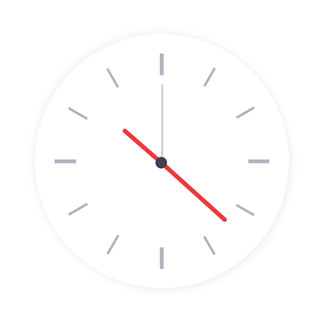

# Twosday 2022's hidden analogue symmetry

## Intro

Yesterday, 20th Feb 2020 was supposedly [Twosday](https://www.google.com/search?q=twos+day), both a [palindromic](https://en.wikipedia.org/wiki/Palindrome) and [ambigramic](https://en.wikipedia.org/wiki/Ambigram) date – at least on a calculator – and was celebrated by number nerds everywhere (myself included!).

However, those of us [who get really geeky over times](/archive/projects/personal/futureclock/) were hanging out for the double-whammy of 22:22 on 22/02/2022!

<Twitter>
  <blockquote class="twitter-tweet"><p lang="en" dir="ltr">I got a Full House on
    <a href="https://twitter.com/hashtag/Ambigram?src=hash&amp;ref_src=twsrc%5Etfw">#Ambigram</a> Day yesterday!<br><br>Note
    the battery; it took a day of meticulous planning and power management and an evening of telling people to go away
    and not bother me 😆<a href="https://twitter.com/hashtag/Twosday?src=hash&amp;ref_src=twsrc%5Etfw">#Twosday</a>
    <a href="https://twitter.com/hashtag/TwosdayTuesday?src=hash&amp;ref_src=twsrc%5Etfw">#TwosdayTuesday</a> #22022022
    <a href="https://t.co/Pobe5HpLGs">pic.twitter.com/Pobe5HpLGs</a></p>&mdash; Dave Stewart (@dave_stewart)
    <a href="https://twitter.com/dave_stewart/status/1496413189776588805?ref_src=twsrc%5Etfw">February 23, 2022</a>
  </blockquote>
</Twitter>

22:22 has been my favourite time for a number of years now, chiefly because of the digital symmetry, but also because of its _analogue_ symmetry. At around 20 past 10 **the hands of the clock seem like they are in direct alignment with each other** at around 180°:



So the question is: does 22:22 – ***and therefore Twosday*** – have an analogue symmetry hidden inside its digital one!?

## Theory

### Abstract

If you consider the hands of the clock:

- at 10 o'clock the hour hand is ***precisely ⅓ before the 12***
- at 20 past the minute hand is ***precisely ⅓ before the 6***

But at 22:22 the proportions _cannot_ be thirds because both hands will have travelled a bit further (22/60), so:

- the minute hand is ***22/60 away from 12***
- the hour hand is ***22/60 between 10 and 11***


So the question is: with these additional small offsets, do the hands still line up to 180°?

### Principle

The way to think about the problem is to imagine the minute hand driving the hour hand.

For every minute that passes:

- the minute hand moves by 1/60 of 360°
- the hour hand moves by 1/60 of (360° / 12) or 30°

So at 22:22:

- the minute hand is 22/60 x 360 degrees
- the hour hand is (10/12 x 360 degrees) + (22/60 x 30 degrees)

If you subtract one from the other you get the difference in degrees between them, and _hopefully_ 180°.

## Code

### Attempt 1: solving for 22:22

I like to solve things in code, so here it is:

```js
var f = 22/60
var t = 360
var m = f * t
var h = (10/12 * t) + (f * 30)
console.log(h - m)
```

The result is `179`.

So clearly, this is very close, but not `180`!

### Attempt 2: solving for 22:22:22

But what if we used 22 seconds as well? And how do we do that?

Well, 22 seconds as a fraction would be 22 / (60 x 60) or 22 / 3600, so the code is:

```js
var f = (22/60) + (22/3600)
var t = 360
var m = f * t
var h = (10/12 * t) + (f * 30)
console.log(h - m)
```

And the result is: `176.98333333333335`.

This feels very strange, that such a small adjustment would not only seemingly have such a large impact, but would move the value further away from the magical `180`.

At this point I'm thinking my simple code experiments need some kind of geometric proof, so perhaps there's a Code Pen of a clock online I can tweak and start measuring angles.

### Attempt 3: solving for 180°

Luckily, I found some [clock code online](https://dev.to/code_mystery/simple-analog-clock-using-html-css-javascript-2c6a) that I could quickly edit and create something more interactive.

Tweaking the time value it was suprisingly easy to work out what time would give 180°, and that time was `22:21:45` as you can see in the interactive example below: 

<CodePen hash="qBVKxKq" title="Analogue Ambigram" height="600"/>

But here's the thing...

If we allow ourselves to clamp the time to ***just the minutes*** (which was our original aim) we get ***22:22*** and ***180°*** !

## Conclusion

So, rather amazingly, ***22:22*** on ***22/02/2022*** has _multiple_ embedded ambigrams and palindromes:

- the digital date
- the digital time
- the analogue time

I'd tried to solve this problem before with just Excel and left it at Attempt 2, but thanks to Twosday gave it another shot, and now we have some additional datetime magic to enjoy.

Happy Twosday!
