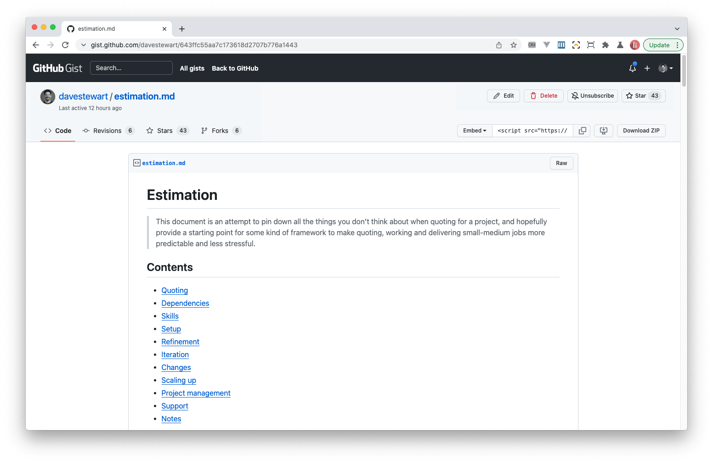
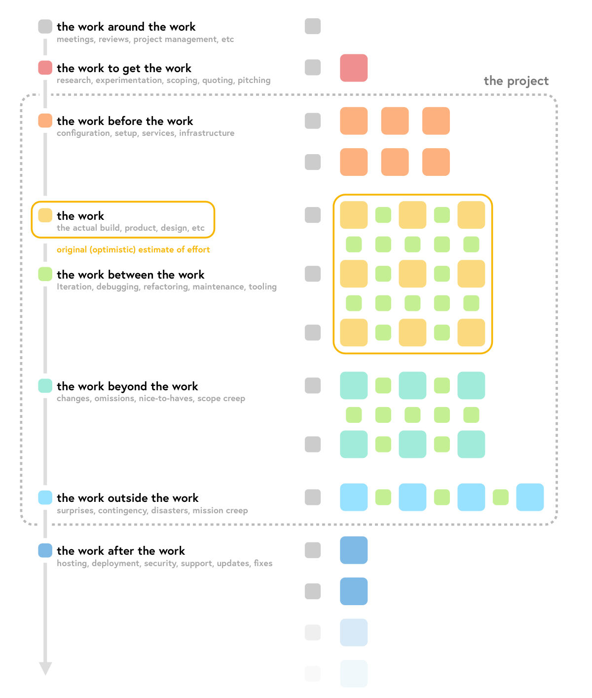
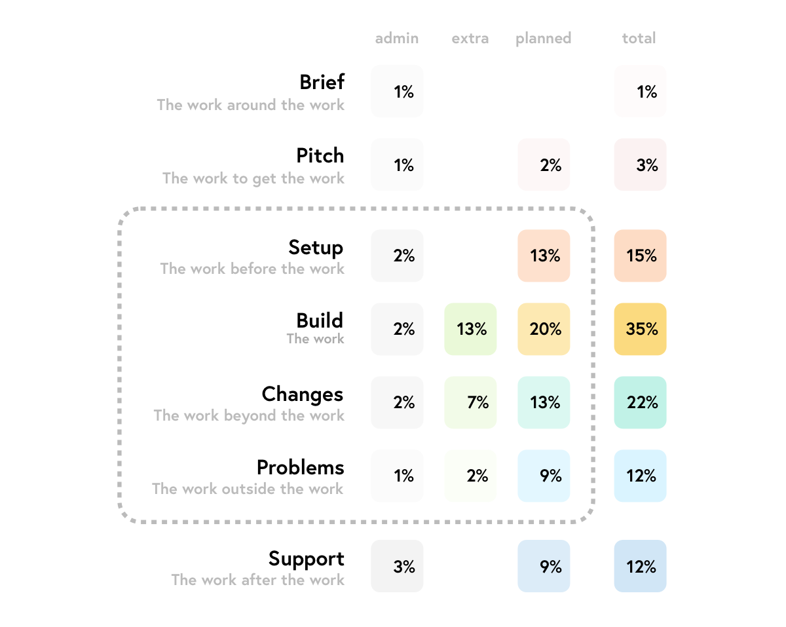

# The work is never just “the work”

## Intro

If you're like me, you're maybe a jobbing dev taking on contracts and occasionally your own gigs (and by-and-large this works out OK) but _maybe_ you secretly hate yourself for being **terrible** at estimation, and wish you were better at it. 

If that sounds like you, read on!

## Background

Last year I took on what seemed like a short, easy-to-deliver project, which over the course of a year turned into the kind of "night of the living dead" slog and because of a variety of factors has _never_ been easy to estimate.

With the latest phase finally delivered, I wanted to conduct a detailed postmortem to understand why my perception of the _actual_ work was so off, and in the process reevaluate everything I know about assumptions and estimation.

In the rest of the article I'll deep dive my own shortcomings around estimation, as well as present a framework to plan and visualise estimates, hopefully helping both of us clear those lurking feelings of confusion and guilt.

## Why is estimating hard?

Estimating is hard because you can't predict the future.

Some of the things I've heard or have tried:

- ***Add on 30% for project management.***
   I don't get this at all; firstly, there's no way I do that amount of project management, and secondly, it doesn't cover or tackle the real causes of a bad estimate.

- ***Double or triple your estimate***
   This is actually one of mine, and based on at least a couple of projects I've quoted for, is approaching something accurate – though again – no real insight as to _why_ the original estimate was not fit for purpose.

- ***Double it, then double it again***
   Sounds crazy at first but the initial estimate is the **work**, the first double is the **details and changes**, and the second double is **problems and bugs**. This begins to stack up in my mind, as long as everything _does_ take twice as long; if not do we _triple_? (thanks to [@panphora](https://twitter.com/panphora) for this one)

Note that in the above points I was careful to avoid using the word "overrun".

Overrun implies that the estimate was **sound** and it was the _execution_ that was not.

However, we know this is generally not the case; you don't take on work just to do more, so the **real** problem is being unable to predict what you will need to do, or how long it will take you to do it.

## Breaking it down

Writing the project postmortem I wanted to be honest about my failings, so I looked at various areas:

- the physical tasks I had to do, no matter if planned or not
- how long it took to do things, whether it was more than estimated, and the reasons why that was so
- the times when skill or knowledge couldn't save the day, perhaps it was more about people or process or time

It wasn't long before I noticed a couple of common threads:

- much of the work was the "work to do the work" rather than the "actual" work
- most of the work was under- or un-estimated because it wasn't the "actual" work

***This was in equal parts both **shocking** _and_ **enlightening**.***

I couldn't believe I had been so blind to this, up until now:

- maybe I had considered this unplanned work as just something you have to do
- maybe I thought my attention-to-detail style was somehow my cross to bear

Reflecting on this, I think most likely it's a mix of misplaced professional pride and a level of cognitive dissonance around how quickly I think professional work _should_ be completed, rather than how long it takes to actually complete; I was effectively _ignoring_ the additional time because "it didn't feel correct".

An analogy that sprang to mind was that of [dark matter](https://www.google.com/search?q=dark+matter); it's invisible (like much of a project's work) but by its gravitational influence, scientists know it makes up the majority of the mass of the universe.

But dark matter aside, the upshot is that this effort – my effort – was not being considered, estimated or paid for!

## Building it back up

It was clear that this "happy path" thinking was not only costly in financial terms, but probably explained the various issues I've had with over-running or over-working over the years – at either mine or sometimes my client's expense.

And though the observations themselves felt extremely valuable, they needed fleshing out and pulling together.

Moving forwards, I wanted to:

- start thinking about some kind of "framework" to fit them in or around
- use them as building blocks to break down any future work, maybe even adding timings 
- shine a light on the overall structure and nature of projects, and their estimation 

Building on my notes so far, I shared the observations on [Twitter](https://twitter.com/dave_stewart/status/1471451034593771523) and began to think about a structure which represented a typical small-to-medium project's lifecycle:

Running with the analogy of the "work to do the work" I ended up with the following structure:

| Phase                     | Tasks                                                        |
| ------------------------- | ------------------------------------------------------------ |
| [The work around the work](https://gist.github.com/davestewart/643ffc55aa7c173618d2707b776a1443#the-work-around-the-work) | Meetings, reviews, project management, etc |
| [The work to get the work](https://gist.github.com/davestewart/643ffc55aa7c173618d2707b776a1443#the-work-to-get-the-work) | Research, experimentation, scoping, quoting, pitching                         |
| [The work before the work](https://gist.github.com/davestewart/643ffc55aa7c173618d2707b776a1443#the-work-before-the-work) | Configuration, setup, services, infrastructure           |
| [The work](https://gist.github.com/davestewart/643ffc55aa7c173618d2707b776a1443#the-work) | The actual build, product, design, etc                               |
| [The work between the work](https://gist.github.com/davestewart/643ffc55aa7c173618d2707b776a1443#the-work-between-the-work) | Iteration, debugging, refactoring, maintenance, tooling |
| [The work beyond the work](https://gist.github.com/davestewart/643ffc55aa7c173618d2707b776a1443#the-work-beyond-the-work) | Changes, omissions, nice-to-haves, scope creep               |
| [The work outside the work](https://gist.github.com/davestewart/643ffc55aa7c173618d2707b776a1443#the-work-outside-the-work) | Surprises, contingency, disasters, mission creep             |
| [The work after the work](https://gist.github.com/davestewart/643ffc55aa7c173618d2707b776a1443#the-work-after-the-work) | Hosting, deployment, security, support, updates, fixes
|

The links above jump directly to the document, which you can read – and if you like – comment on.

Consider it a "work in progress" which I will use, adapt and improve going forward.

## Visualisation

Assuming the chronology is sound, the phases could be represented **graphically**.

The following graphic is **not** an accurate representation of the work, or to scale regarding the work there was to do, but is an initial attempt to view "the work" compared to the **overall** scope of an entire project lifecycle:

It's interesting to see how an original estimate of just "the work" seems insignificant when viewed in context with setup, changes and potential problems.

Of course the next project (or your project) may have very different proportions to this, but it's a starting point. For example the project which triggered this self-reflection, the "work outside the work" ended up being probably _double_ the actual work, which was a bitter pill to swallow, and highlighted something I would dearly like to get better at.

## Analysis

Breaking this (again, inaccurate) diagram down by area (again, units do not represent effort 1:1) provides a little numerical perspective:

  

Reviewing both the numbers and the graphic, one could postulate:

- "planned work" could be maybe a fifth of the total project effort
- there is much work "between" the work; the kind of invisible stuff which _will_ happen
- this "extra work" could be _at least_ as much work as the planned work
- changes should be accounted for, though there will always be things you did not account for!
- each phase of the project will impact time and cost

## Reflection

Again, whilst this currently is not a true representation, it does raise questions regarding the framework going forwards:

- could work be represented proportionally; that is, more complex tasks as bigger squares?
- could there be a formula for the "work between the work"?
- could some kind of checklist provide charts which actually could help with estimation?
- could multiple charts represent cumulative effort by UX, Design and Development?
- how would the shape of charts vary between project, discipline or person?

Whilst I can't answer those questions now, I may attempt to in a future article... or maybe side-project!

There are also many constraints and considerations regarding the _mechanics_ of project management such as project size, team size, project duration and delivery style, but this article isn't the place for that discussion.

## Takeaway

The thing to take away is that a naive estimation of "the work" may only be a fraction of the overall project effort.

Additionally, using some kind of structure (like my document above) breaking down and modelling "the work before / between / around the work" will give you get a much better idea of the tasks you will _actually_ be doing.

I have some additional thoughts on how a framework like this _could_ be used as a basis for a kind of logging and accountability, but again, I will save that for another article.

### Downloads

- Downloadable version of the [infographic](./images/estimation.png)
- Link to the [estimation document](https://gist.github.com/davestewart/643ffc55aa7c173618d2707b776a1443)

## Thanks

I hope you found this article useful and / or enjoyable.

If so, consider following me on [Twitter](https://twitter.com/dave_stewart).

Bye for now!
