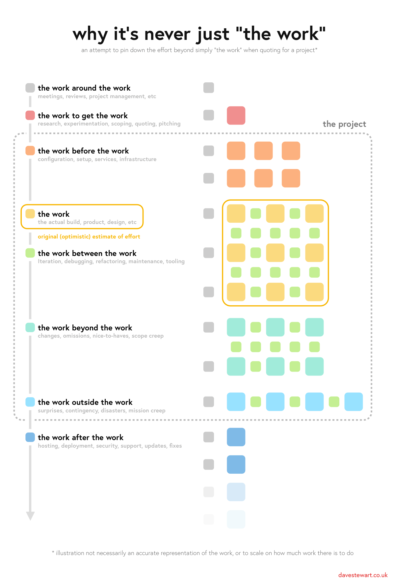

# The work is never just “the work”

## Intro

If you're like me, you're maybe a jobbing dev taking on contracts and occasionally your own gigs (and by-and-large this works out OK) but _maybe_ you secretly hate yourself for being **terrible** at estimation, and wish you were better at it. 

If that sounds like you, read on!

## Background

Last year I took on what seemed like a short, easy-to-deliver project, which over the course of a year turned into a kind of "night of the living dead" slog, and because of a variety of factors, had _never_ been easy to estimate.

With the latest phase finally delivered, I wanted to conduct a detailed postmortem to understand why my perception of the _actual_ work was so off, and in the process reevaluate everything I know about assumptions and estimation.

In the rest of the article I'll deep dive my own shortcomings around estimation, as well as present a framework to plan and visualise estimates, hopefully helping both of us clear those lurking feelings of confusion and guilt.

:nav-toc{exclude="intro,background,thanks" type="list" prompt="Table of contents"}

## Why is estimating hard?

Estimating is hard because you can't predict the future.

Some of the strategies I've heard or have tried:

- ***Add on 30% for project management.***
   I don't get this at all; firstly, there's no way I do that amount of project management, and secondly, it doesn't cover or tackle the real causes of a bad estimate.

- ***Double or triple your estimate***
   This is actually one of mine, and based on at least a couple of projects I've quoted for, is approaching something accurate – though again – no real insight as to _why_ the original estimate was not fit for purpose.

- ***Double it, then double it again (4x-it)***
   Sounds crazy at first but the initial estimate is the **work**, the first double is the **details and changes**, and the second double is **problems and bugs**. This kind-of makes sense to me, assuming everything _does_ take twice as long; otherwise, do we _triple_ i.e. 9x-it? (thanks to [@panphora](https://twitter.com/panphora) for this one)

Note that in the above points I was careful to avoid using the word "overrun". 

Overrun implies that the estimate was **sound** and it was the _execution_ that was not. However, we know this is generally **not** the case; you don't take on work just to do **more**, so the **real** problem is being unable to predict what you will need to do, and how long it will take you to do it.

_Also, check [this comment](https://news.ycombinator.com/item?id=36160200) on the Hacker News post for this article; it absolutely nails the question "Why is estimating hard?"._

## Breaking it down

To uncover my estimation blind spots, I set out to dissect the previous months' effort with clear and unbiased honesty.

I aimed to:

- review the work completed and contrast it to original estimates
- root out failings in areas such as planning, skills, communication, etc
- dig into the mental and technical incongruity between plan and eventuality
- ponder previous projects and compare previous failings
- identify generic patterns I could apply to future situations

I reviewed the project's notes, files and code, mentally reliving the process of working on each, documenting what I remembered. Whilst recalling the overall thrust of each unit of work, I attempted to keep my observations generic – so specifics around a particular technology for example – wouldn't muddy the underlying causes for any overrun.

Building on my notes, I shared the observations on [Twitter](https://twitter.com/dave_stewart/status/1471112458341335041) and encouraged others to comment:

Click the image above and [have a read](https://gist.github.com/davestewart/643ffc55aa7c173618d2707b776a1443) as it uncovers the vast amount of nitty-gritty that we humans too easily forget.

I'm sure you'll be nodding along thinking "wow, that's got me before too!".

## Reviewing the findings

The first major takeaway was that the actual process of **writing the postmortem** was extremely valuable.

I had been aware during the project that there seemed to be a lot of "extra work", but putting it down on paper highlighted the multitude of "invisible" tasks and challenges which every web development project has.

There were two common threads:

- much of the work was the "work to do the work" rather than the "actual" work
- most of the work was under- or un-estimated because it wasn't the "actual" work

***This was in equal parts both **shocking** _and_ **enlightening**.***

I couldn't believe I had been so blind to this, up until now:

- perhaps I considered this unplanned work as just something you have to do?
- perhaps I thought my attention-to-detail style was somehow my cross to bear?

Reflecting on this, I think most likely it's a mix of misplaced professional pride and a level of cognitive dissonance around how quickly I think professional work _should_ be completed, rather than how long it takes to actually complete; I was effectively _ignoring_ the additional time because "it didn't feel correct".

An analogy that sprang to mind was that of [dark matter](https://www.google.com/search?q=dark+matter); it's invisible (like much of a project's work) but by its gravitational influence, scientists know it makes up the majority of the mass of the universe.

But dark matter aside, the upshot is that this effort – my effort – was not being considered, estimated or paid for!

## Building it back up

It was clear that this "happy path" thinking was not only costly in financial terms, but probably explained the various issues I've had with over-running or over-working over the years – at either mine or sometimes my client's expense.

And though the observations themselves felt extremely valuable, they needed fleshing out and pulling together.

Moving forwards, I wanted to:

- start thinking about some kind of "framework" to fit them in or around
- use them as building blocks to break down any future work, maybe even adding timings 
- shine a light on the overall structure and nature of projects, and their estimation 

The distinction of the work "before / between / around" the work felt like the beginnings of said framework, and I eventually settled on:

| Analogy                                                    | Real world                                                                 |
|------------------------------------------------------------|----------------------------------------------------------------------------|
| :swatch{color="#CCCCCC" label="The work around the work"}  | ***Admin*** Meetings, reviews, project management, etc                  |
| :swatch{color="#EF8F8F" label="The work to get the work"}  | ***Acquisition*** Research, experimentation, scoping, quoting, pitching |
| :swatch{color="#FCB17F" label="The work before the work"}  | ***Preparation*** Configuration, setup, services, infrastructure        |
| :swatch{color="#FBDA7F" label="The work"}                  | ***Execution*** The actual build, product, design, docs, tests, etc     |
| :swatch{color="#C4EF93" label="The work between the work"} | ***Iteration*** Iteration, debugging, refactoring, maintenance, tooling |
| :swatch{color="#A1EBDA" label="The work beyond the work"}  | ***Changes*** Changes, omissions, nice-to-haves, scope creep            |
| :swatch{color="#98E2FF" label="The work outside the work"} | ***Problems*** Surprises, contingency, disasters, mission creep         |
| :swatch{color="#7FBAE7" label="The work after the work"}   | ***Support*** Hosting, deployment, security, support, updates, fixes    |

Whilst the above analogies roughly align with real world project phases, reframing the effort in such an abstract manner felt helpful in decoupling the true nature of the work from my idealised optimism.

## Visualisation

During this investigation, I had begun to wonder if I could represent the findings **graphically**.

The following graphic is **not** an accurate representation of the work, or to scale regarding the work there was to do, but is an initial attempt to view "the work" compared to the **overall** scope of an entire project lifecycle:

  

When I designed the graphic, I didn't really have in my head how much effort each square represented, but in hindsight for a small or medium project, it could be a day. Each line could be a week, with the smaller grey dots as weekly meetings, and the smaller green dots evenings and weekends.

But again, this isn't scientific, more a "finger in the air" visualisation.

Also, as someone [noted](https://news.ycombinator.com/item?id=36150105#36162646) on Hacker News, it's worth remembering that a day is rarely 8 full-hours of work! How does that impact your overall estimate?

It's interesting to note:

- the relatively small proportion of "the work" to the overall effort, aka [planning fallacy](https://en.wikipedia.org/wiki/Planning_fallacy)
- the amount and proportion of work "between" the work, aka [project complexity](https://en.wikipedia.org/wiki/Project_complexity)
- the amount of work "outside" the project, aka [unknown unknowns](https://en.wikipedia.org/wiki/There_are_known_knowns)

## Analysis

Breaking this (again, inaccurate) diagram down by area (again, units do not represent effort 1:1) provides a little numerical perspective:

  

Comparing both the numbers and relationships, one could postulate that:

- the "planned work" may be as little as a fifth (20%) of the total project effort
- there is much work "between" the work; the kind of invisible stuff which _will_ happen
- the "extra work" could be as much work (or more) as the planned work (22%)
- the "extra work" increases proportionally to the complexity of the work (compare yellow to turquoise and blue)
- changes (22%) must be accounted for, though there will always be things you did not account for (min 12%)
- all these seemingly small changes have a large *overall* impact on time and cost

## Modelling

Of course, every project is different; there's nothing to say that the proportions and numbers above relate to any other team or project.

The difficult project I spoke about at the start had three distinct phases, each of which threw up different estimation challenges and realities:

- Phase 1 required building a prototype around a partner's legacy technology
- Phase 2 threw up issues around maturing the architecture whilst delivering new functionality and removing old
- Phase 3 revealed major unsuitability around the (inherited) database stack that ballooned the "work outside the work" to nearly _double_ the originally-planned work

How would this project look if modelled?

You can click through the visualisation below to get a (very!) rough feel:

:media-gallery{media="comparison" prev-text="Earlier" next-text="Later" :wrap="false"}

As you click, imagine it's one or some of *your* previous projects, and see if it triggers any painful recollections. Perhaps the proportions are different, perhaps the tasks are different, but maybe it's a similar picture of idealism vs reality worth bearing in mind next time you think a project will be just "the work".

## Reflection

### On the framework

Well, it's been fun to explore the dark side of estimation with a combination of anecdotal evidence and visualisation.

I've had various thoughts about taking the ideas forwards; here are just a few:

- could work be represented proportionally; that is, more complex tasks as bigger squares?
- could some kind of checklist help create charts which *actually* could help with estimation?
- could there be a formula for the "work between the work"?
- could multiple charts represent cumulative effort by UX, Design and Development?
- how would the shape of charts vary between project, discipline or person?

There are also myriad considerations and constraints regarding the _mechanics_ of project management such as project size, duration, phase and maturity, or team size, experience, optimism or biases.

Whilst I would love to spend more time on this, for now it will have to remain a thought experiment!

### On estimation

As I've mentioned various times throughout this article, I've certainly taken some artistic and numerical license.

However, the aim of this exercise was to get to grips with the distortion field around accurately estimating projects when our brains are wired to ignore the detail – and there is *so much* detail.

Yes, there are estimation frameworks such as T-shirt Sizes, Planning Poker and we are all used to Agile, but the problem remains to be solved – as humans and developers, how can we take responsibility for more accurately gauging the work "between", "beyond" and "outside" "the work"?

## Takeaway

The key takeaway is that even a detailed estimate of "the work" can miss significant "invisible" work.

Without a proper audit it is impossible to properly quantify how long work takes over the longer term, but given the breakdowns above "double it and double it again" doesn't seem so farfetched; at the very least it makes a good first marker to sanity-check your next estimation, be it a sprint or a project.

Some strategies and thoughts going forward:

- Run postmortems on past projects to anchor yourself to reality
- Consider timing and logging future work to equip yourself for the future
- Get familiar with, and work to improve, your own estimation biases and weak spots
- Remember every project *will* have *most* of these invisible "work" types
- If you end up in trouble, prefer "raising a hand" to "doubling down"
- Beware fixed-price projects!

Also, this article has been cited more widely; check the comments for some fantastic takes and insights:

- [Hacker News](https://news.ycombinator.com/item?id=36150105)
- [LinkedIn](https://www.linkedin.com/feed/update/urn:li:activity:7170824371018694658/)

Finally, you're welcome to use [any of the assets](https://github.com/davestewart/davestewart-site/tree/main/content/blog/work/project-estimation) for your own purposes, I just ask for a link to this article in return.
