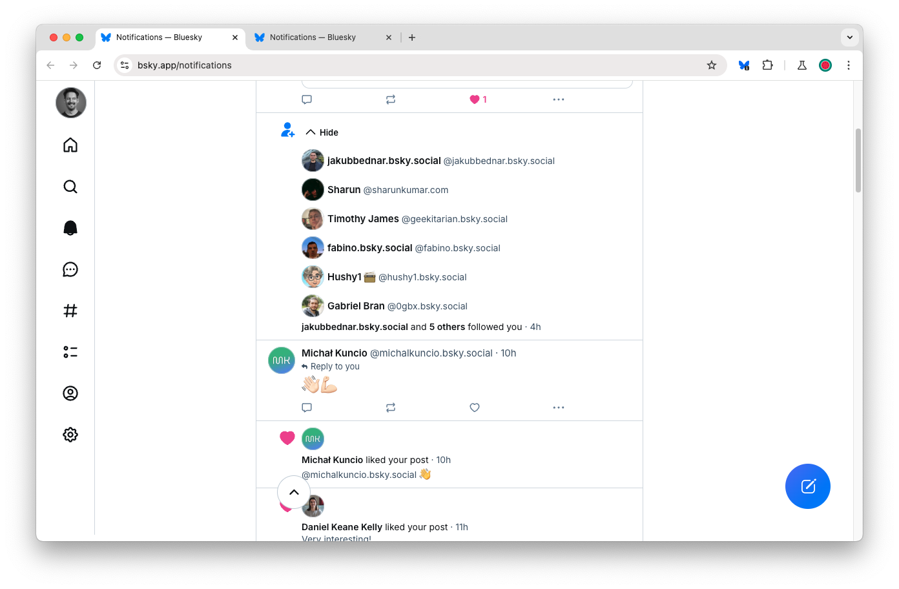
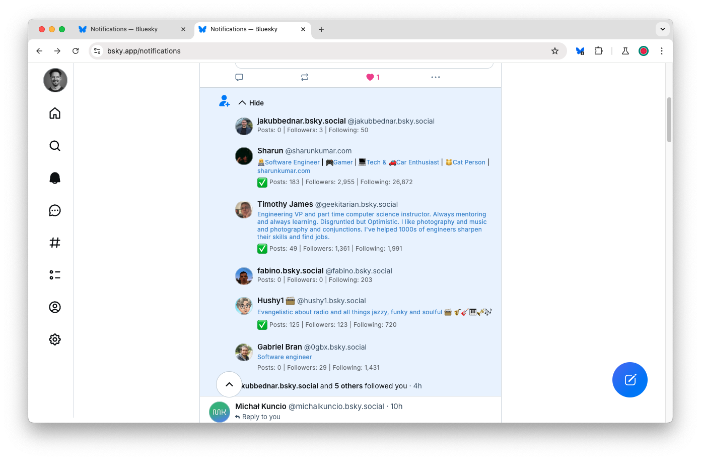

# Bluesky Follower Info

## Overview

Bluesky's notification feed unfortunately gives you very little information about new follows, so you have to spend quite a bit of time hovering over avatars, or navigating to new pages:

Bluesky Follower Info is a Chrome extension that inserts users' profile descriptions, engagement and popularity stats directly in the page:

## Features

Notifications display:

- Simplified profile description
- Posts, followers and following counts
- Icons for:
    - 📝 Posted
    - ✅ Engaged (more than 25 posts)
    - 🔥 Popular (more followers than following)
- newer followers shown in blue (followers > 2 weeks old shown in grey)

Additionally:

- Notification summaries are highlighted in blue (so you don't miss them)
- Only on-screen notifications are fetched (and refreshed if > 1 week old).

## Installation

Visit the [Chrome Web Store](https://chromewebstore.google.com/detail/bluesky-follower-info/fokpfcfpgdlmnbjajbdeofkemfblbnbh) page then click the "Add to Chrome" button.

_You will need to reload any loaded Bluesky pages after installation._

## Links

- [Chrome Web Store page](https://chromewebstore.google.com/detail/bluesky-follower-info/fokpfcfpgdlmnbjajbdeofkemfblbnbh)
- [GitHub repo](https://github.com/davestewart/bluesky-follower-info)
- [My Bluesky profile](https://bsky.app/profile/davestewart.uk)
