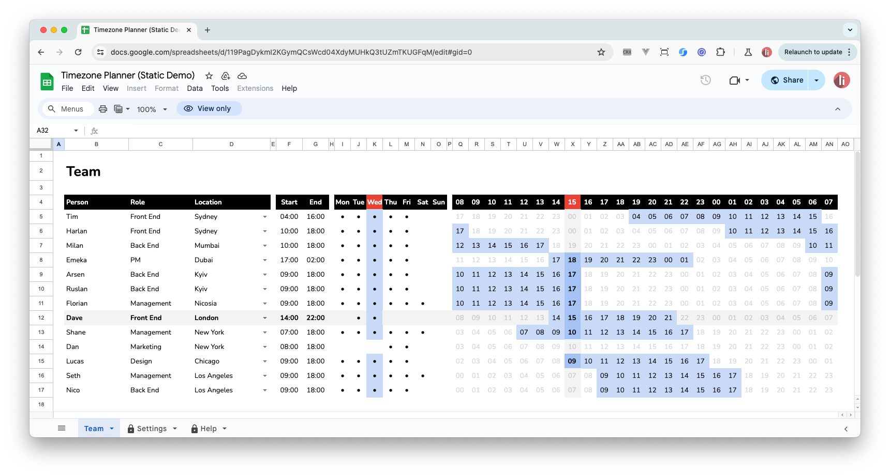

# Timezone Planner for Remote Teams

## Intro		

If you're like me and you work on remote teams, you know juggling timezone differences is _hard_.

Not just understanding when folks are supposed to be online, but in what **context**; is it a reasonable hour, are they missing an evening with their family, maybe they're up outrageously early or late to align with a stand-up – or maybe they should be working but you suspect they're not?

And keeping yourself accountable can be difficult too; it can be easy to fudge starting or finishing on time, or miss connecting with someone because you didn't understand the overlap.

Just checking the time and doing some mental arithmetic is not always sufficient.

### Product

[Timezone Planner for Remote Teams](https://davestewart.gumroad.com/l/timezone-planner) lets you visualise your remote team's availability, their time of day, working hours, to be more practical and conscientious in planning your work, meetings and deadlines.

It comes in the form of a [Google Sheet](https://www.google.co.uk/sheets/about/), so it's ubiquitous and even _customisable_ if you want additional control:

You can leave it open in a browser tab, and check-in as needed. It renders from your timezone and updates throughout the day so, it's simple to grok everyone's working hours, when you need to take that call or complete your work.

### Benefits

In the example above:

- my timezone is highlighted in grey (London)
- my current day and time are shown in red (it's Wednesday at 15:00)
- I can see that:
  - the Back End guys are finishing their day in Ukraine
  - the CEO will have been up a couple of hours in NYC 
  - the Designer is just getting started in Chicago
  - I'm working until 10 tonight to align on US time
  - I'll even get a few hours with our early-rising Aussie developer!

### Features

The spreadsheet supports:

- multiple team members
- location, and available hours & days per team member
- highlighting for current day, time, and available times
- automatic timezone calculation, including Daylight Saving Time
- sorting and filtering
- anything else you can do with a spreadsheet!

### Demo

To check out a static demo (all interactivity, formulas, scripts and updates removed) click below:

- [Timezone Planner (Static Demo)](https://docs.google.com/spreadsheets/d/119PagDykmI2KGymQCsWcd04XdyMUHkQ3tUZmTKUGFqM/edit?usp=sharing)

Hover over the comment annotations for additional context.

## Purchase

### Product

The complete Google Sheet is available as a one-time purchase from Gumroad:

<a class="gumroad-button" href="https://davestewart.gumroad.com/l/timezone-planner">Purchase on</a>

### Usage and License

You're free to use the sheet – forever – as you see fit:

- add as many team members as you like
- edit, customise, copy and reuse the spreadsheet
- track multiple teams, friends, or family, in multiple spreadsheets
- share the sheet as a viewer – but don't distribute copies

The last clause is because the license is **non-transferable**; you can't give a copy of the sheet away (even a modified version) to other team members, friends, or contacts to start tracking their own teams or contacts; they would need to [purchase](https://davestewart.gumroad.com/l/timezone-planner) their own copy – _then_ you could share **your** copy of the sheet with them.

> For those that want tighter integration with their team... hang tight; I'm considering a [web app](http://timezone-planner.app) version of the planner which would provide the same functionality but without the timezone and sharing limitations.
> 
> Subscribe to my [Gumroad list](https://davestewart.gumroad.com/subscribe) to be kept informed.

_Note: These terms aren't meant to be restrictive for the sake of it, but rather to support creators like myself in building, marketing and maintaining useful tools._

Thank you 🙏

## Setup		

The sheet comes with some sample members, just to get you started:

You can delete _all but the first row_, which you'll use as a template for new members.

### Add your team

To add new members:

- **duplicate** an existing team member's row. You can:
  - right-click the row header and choose **Copy**, then **Paste** to an empty row, or
  - select the active cells in a row, then **drag** the **fill handle** whilst holding `Opt` / `Alt` 

Then:

- edit the **Name**, **Role**, and **Location** _(the timezone / `TZ` column is calculated automatically)_
- edit the available **Hours** (as time) and **Days** _(Mac users can add bullets with `Opt`+`8`, but you can use any character)_

### Share with your team

For team members in the same timezone, you can simply share the sheet.

For team members in different time zones to be able to view from their timezone, they'll need to:

- **make a copy** of the sheet
- update their **Location** in the [Settings](#sheet-settings) tab

> ***Note:*** the copy will **no longer be linked** to the Master sheet. Unfortunately, this is a limitation of Google Sheets.

### Time settings

To change the timezones matrix starting hour:

- in the **Settings** tab, edit the **Matrix / Start Time** value

To change the sheet's timezone: 

- make a copy of the sheet via **File > Make a copy**
- in the **Settings** tab, edit the **User / Location** value

## Usage		

### Tips and tricks

Here are a few tips for working with team times:

- Only show user's hours when they're available
  - Add or remove a bullet `•` (or any character) from the **Days** columns

- Indicate working through the night into the small hours
  - Enter an **End** hour earlier than **Start** time, i.e. `21:00` | `02:00`

- Indicate being away or on holiday
  - Edit the **Location** column and optionally change **Times** or **Days**

- Align working hours with other team members:
  - Change **Start** and **End** times as required

> ***Remember***: if you made a **copy** of your sheet, this will only update for your sheet.

### Customisations

There are so many ways to customise the sheet!
 
Here are some ideas:

- Add a hyperlink to users' **Names** to:
  - send an email; `mailto:<address>`
  - open in Slack; `https://app.slack.com/client/<workspaceId>/<userId>`

- Add additional columns and/or links, such as:
  - Phone Number
  - LinkedIn page
  - Notes

- Sort or filter users by adding a filter to the first block:
  - select any cell in the first block
  - hit `Cmd`+`A`
  - Right-Click and choose "Create a filter"
  - to enable ordering by Timezone, make sure to unhide the **TZ** column

- Add top level groupings (like a pivot table):
  - add a column before the main block
  - insert rows as required
  - add top-level labels, such as "Design", "Engineering", etc
  - reorder rows as required

- Delete **Available Days** if you don't need them:
  - select the columns which contain the days
  - Right-Click and choose "Delete columns"

- Add the current **Location** to the Team sheet
  - select the cell which says "Team"
  - click in the Formula Bar
  - paste `="Team (" & INDIRECT("L") & ")"`

## Problems		

Occasionally, the Matrix may get stuck on the Loading status. If this happens:

- **unhide** the **TZ** column if it is hidden
- **select** the cells containing the `TZ()` function
- **Copy**, **Delete**, then **Paste** the cells over the same selection
- this should re-trigger the function to work again

If use the **fill handle** to create many new rows, conditional formatting may break for later rows – because the **Start** and **End** hours can be converted to days in the future. If this happens:

- undo the fill, or delete the new rows
- hold `Opt` or `Alt` as you fill (which creates an exact copy of the data)

## Support

As this is a one-time purchase, there's no support as such, but I may release updates or new features from time to time.

I will notify users via the Gumroad mailing list below:

- [davestewart.gumroad.com/subscribe](https://davestewart.gumroad.com/subscribe)

If you need any custom sheet development, get in touch via the links below.

