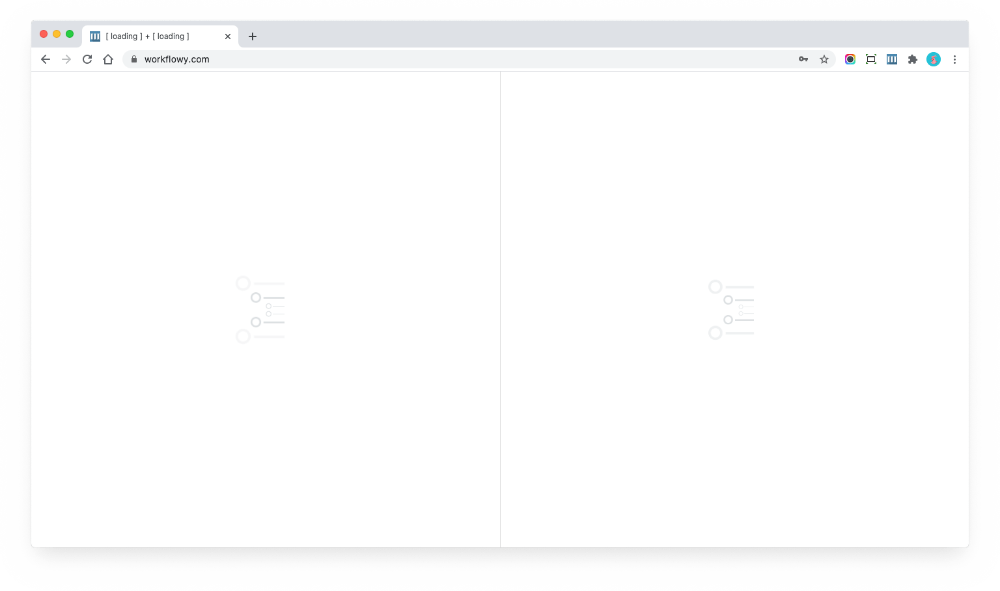
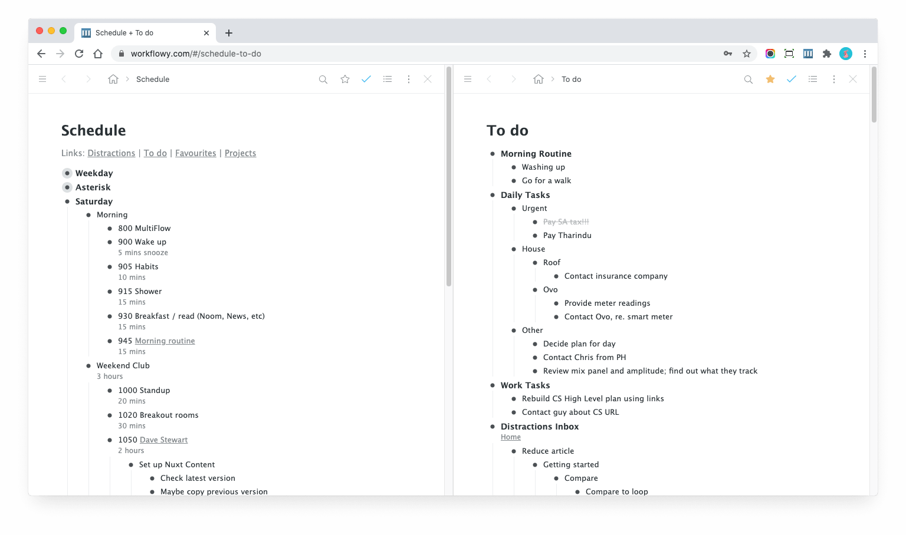
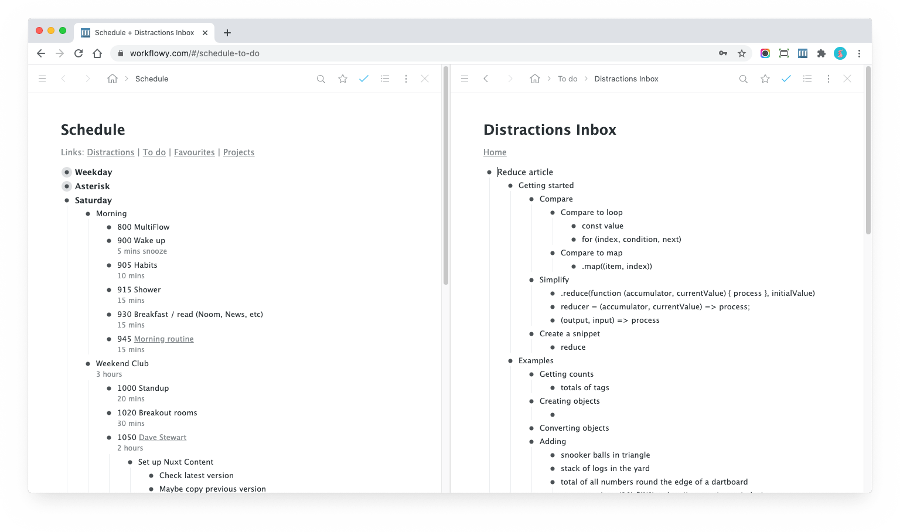
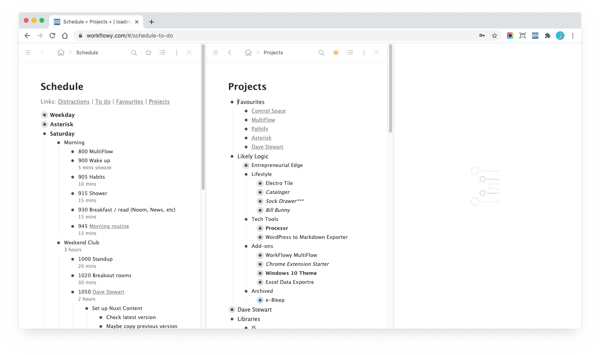
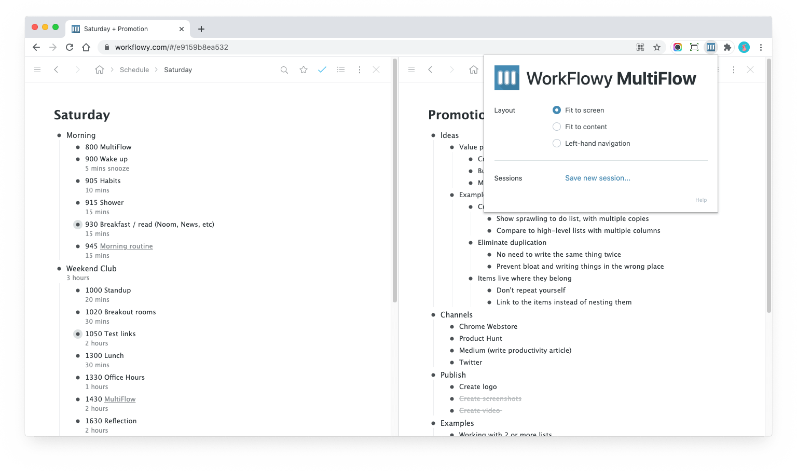
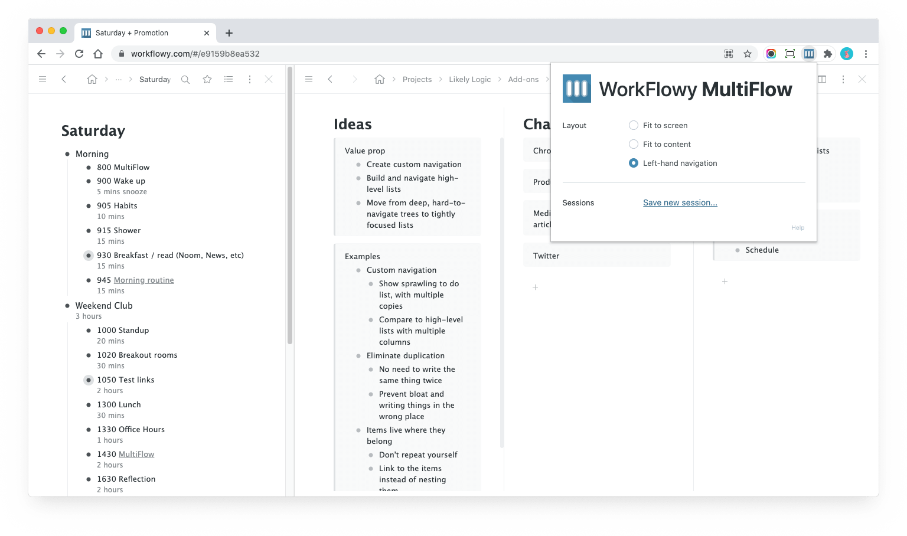
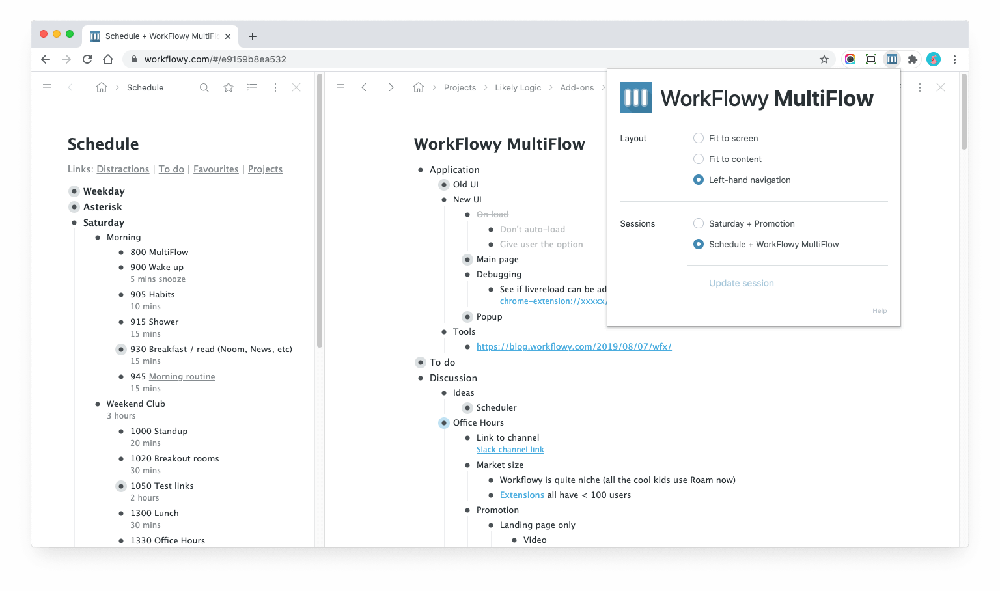

# WorkFlowy MultiFlow

## Overview

WorkFlowy MultiFlow adds a multi-column view to WorkFlowy.

This lets you to maintain an overview and manage relationships between several trees at once.

## Installation

Visit the [Chrome Web Store](https://chrome.google.com/webstore/detail/workflowy-multiflow/khjdmjcmpolknpccmaaipmidphjokhdf?hl=en-GB) and click the "Add to Chrome" button.

When the icon pops up in the toolbar, you'll want to *pin* it:

- Click on the icon and Select "Pin"
- If you lose the icon, click on the Extensions menu, fine MultiFlow, and click the "Pin" icon

If you have any WorkFlowy tabs open, you may need to reload them.

## Working with columns

### Opening columns

You can open new columns by Cmd/Ctrl+Clicking on:

- Bullets
- Internal links to other WorkFlowy pages
- The last breadcrumb item (the page title)

The first time you open a new column, it will reload the current column and the new column into frames:

Once loaded, you should see both your previous and new column:

### Updating content

To change the content of the right column, Cmd+Click any link on the left to change the content (this time it should be instant):

As you can see, I keep some links in the bullet comments at the top of my schedule to allow me to quickly jump to my "Distractions" list!

You can then use your browser's "Back" button to go back (History works as you would expect!).

Note that Cmd/Ctrl+Clicking in a column will **always** open the link / bullet in a frame on the right, so you can open as many columns as you like: 

### Closing columns

To close a column, click the &times; button top right.

If you only have two columns, and you close one, you will be switched back to normal WorkFlowy.

Note that MultiFlow will save all frames (unless you Cmd/Ctrl click the &times; ) when you close them, so when you open new columns, they will "appear" to load instantly.

## Moving data around

Unfortunately, the limitation of HTML frames means you can't drag and drop bullets. That would be amazing, but you'll have to wait for the WorkFlowy team to build this functionality.

However, you can **cut and paste**!

Simply select one or more bullets in one panel, cut them, and paste them in another panel.

Depending on where you cut and paste to-and-from, the paste should be instant, but you may notice a short delay for related frames to update as the data is synced in the background.

## Options panel

Click the MultiFlow icon in the browser toolbar to see options:

The panel has been simplified in v1.6 to just Layout and Sessions.

The layout options provide various layouts, including "Left-hand navigation" which can be useful for things like boards:

## Sessions

You can also save and load sessions, by clicking the "Save Session" button in the panel:

Once you have more than one session, load, update, or save new ones, as well as reorder with drag and drop.

Note that sessions are saved with the extension. Uninstalling the session will delete any saved sessions.

## Limitations

There are a few limitations that I am working to fix:

- doesn’t work as well on Beta *(fix is currently in review)*
- doesn’t work on www.workflowy (vs just [https://workflowy](https://workflowy/)) *(fix is currently in review)*
- doesn’t work in chrome app *(I think it does, so happy to shown if it’s not)*
- working with WFx *(think I can make it work; may cause issues with history though)*

I'm crazy-busy at the moment but will get to them in time.

## Todos

Software is never really finished. Here's a few things I'd like to get to in time:

- Make it work on Firefix, Brave, etc
- Allow saving of a single frame (right now you can only save 2+ frames)
- Resizable frames (not 100% sure I want to go down this rabbit hole)

## Video

Here's a video of the 1.0 version of WorkFlowy, which should give you some idea of how to use it.

<MediaVideo
  src="https://youtube.com/embed/Iy1DuGjUhR4"
  width="560"
  height="315"
/>

## Support

If you need help, [tweet](https://twitter.com/compose/tweet?text=@davestewart) me and I'll see if I can help!

If you install WorkFlowy, and like it, please rate it and leave a nice review on the [Chrome Web Store](https://chrome.google.com/webstore/detail/workflowy-multiflow/khjdmjcmpolknpccmaaipmidphjokhdf?hl=en-GB).

You can also show support on Product Hunt:

I hope you enjoy using MultiFlow!

## Links

- [Chrome Web Store](https://chrome.google.com/webstore/detail/workflowy-multiflow/khjdmjcmpolknpccmaaipmidphjokhdf)
- [Indie Hackers](http://indiehackers.com/product/workflowy-multiflow)
- [Product Hunt](http://producthunt.com/posts/workflowy-multiflow)
- [Reddit](http://reddit.com/r/Workflowy/comments/l9eoqz/workflowy_multiflow_navigate_organise_maintain/)

