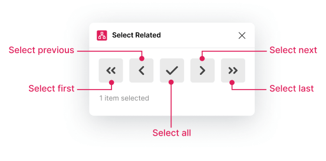

# Figma Select Related

## Overview

Figma Select Related is a plugin that helps you navigate complex component hierarchies by selecting related items (cousins) based on their relative position in the tree.

## Purpose

Selecting items this way is useful when:

- you cannot select by similar properties
- you want to contain selection to the closest common ancestor

Once selected you can do things like:

- move
- copy/paste to replace
- run additional commands

## UX

The plugin offers multiple ways to interact with related components:

{srcset="images/figma-select-related-ui.png 533w, images/figma-select-related-ui@2x.png 1066w"}

Quick-select buttons through the plugin menu:

- Select all related items
- Navigate to next/previous related item
- Move up or down the component tree (with `Alt` key)

Commands available via `Cmd`+`/`:

- Select All related items
- Select Next related item
- Select Previous related item

This makes it easy to rapidly select items or repeat the last command without opening the UI.

## Links

- [GitHub](https://github.com/davestewart/figma-select-related)
- [Figma Community](https://www.figma.com/community/plugin/1234204646989309417)
- [Demo File](https://www.figma.com/file/92mjHSpXeWV4CY2Bfp7GVk/Select-Related-Demo)
