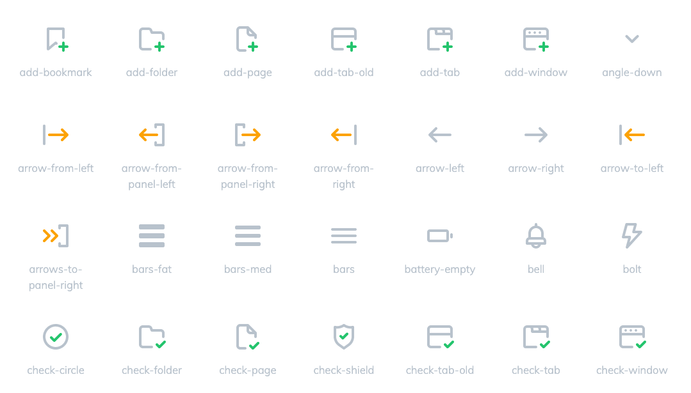

# Outliner

## Overview

Outliner is a Node package that converts SVG strokes to outlined fills:

It is designed for:

- icon creators; no more locking in those curves and losing your vector tweaks!
- developers; work with clean SVG conversions and manipulate attributes in code

## Rationale

Outliner came into existance because:

- outlined strokes are more reliable in the browser environment
- you want to keep strokes *non-outlined* in authoring tools
- tools like [Figma](https://www.figma.com/) and [Sketch](https://www.sketch.com/) don't have flexible enough authoring-time outlining or export options 

Automating the conversion of strokes post-export gives the best of both worlds. 

## Package

Outliner is built on [Maker JS](https://github.com/Microsoft/maker.js) and runs as a global service or project dependency, monitoring and converting files as they are exported:

## Output

## Links

- [GitHub](https://github.com/davestewart/outliner)
