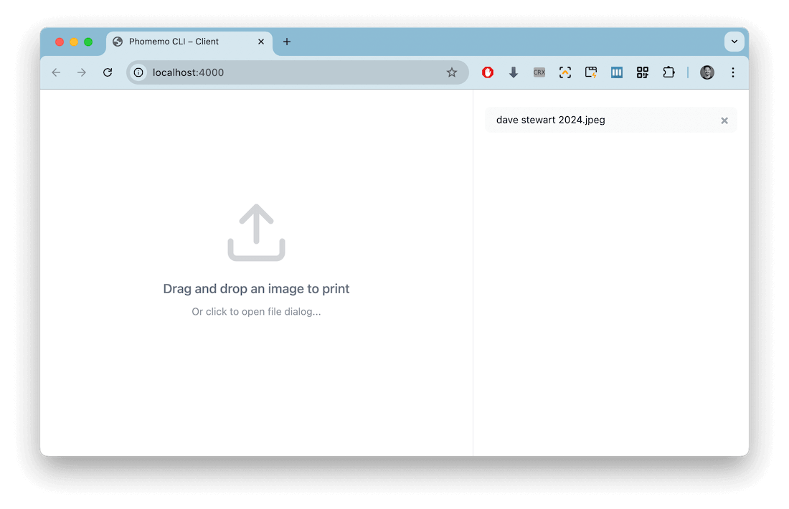
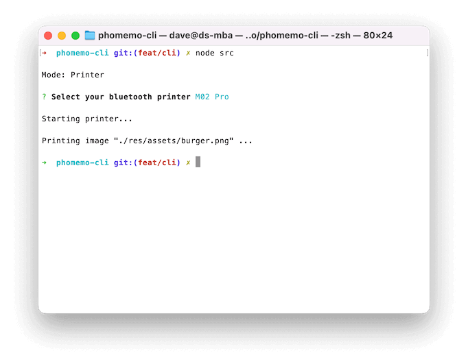
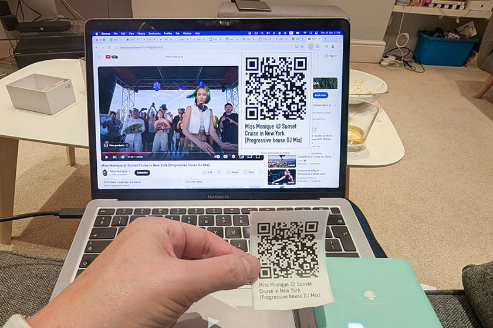

# Phomemo CLI

## Overview

The pocket-sized [Phomemo M02](https://phomemo.com/en-gb/products/m02-portable-printer) is a portable, thermal printer perfect for labels, stickers, and quick prints.

[Phomemo CLI](https://github.com/davestewart/phomemo-cli) is a Node.js package that enables printing via the terminal, a REST API, or Browser UI.

## Usage

Start the script by running it from the terminal.

Depending on what parameters you pass, it will run in one of two modes:

- [server](#server-mode) – where you print files by selecting them from a web browser
- [printer](#printer-mode) – where you print files one at a time from the terminal

## Server Mode

Running in server mode is generally the most user-friendly experience:



Start the server by running the following command:

```bash
node src --port 4000
```

You can drag and drop images from your desktop, re-print files, delete files, etc.

When the server is running, you can also `POST` images from other applications to print directly to the printer:

```http
POST http://localhost:4000/print?scale=478&dither=1
```

## Printer Mode

Printer mode lets you print via the terminal only:



To print a single file, pass the `--file` parameter with a file path:

```bash
node src --file path/to/file.jpg
```

You can pass additional commands like so:

```bash
node src --file path/to/file.jpg --dither --debug
```

Full instructions are available in the [README](https://github.com/davestewart/phomemo-cli/blob/main/README.md).

## Use case

I built Phomemo CLI in order to complete a personal project, my [Birthday Timeline Poster](/projects/personal/birthday-timeline/)!

[](/projects/personal/birthday-timeline/)

This project allowed me to print QR codes live at a significant birthday celebration, so folks could annotate a visual timeline with links to music, facebook posts, map references, or any other online resource.


## Links

- [GitHub](https://github.com/davestewart/phomemo-cli)
- [Phomemo M02 Pro](https://eu.phomemo.com/products/m02-pro-portable-printer)
