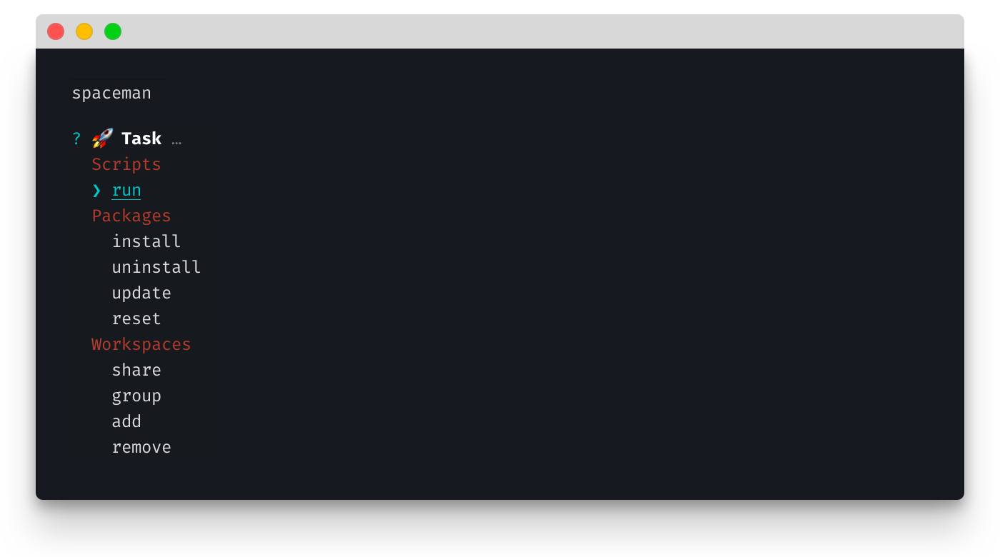
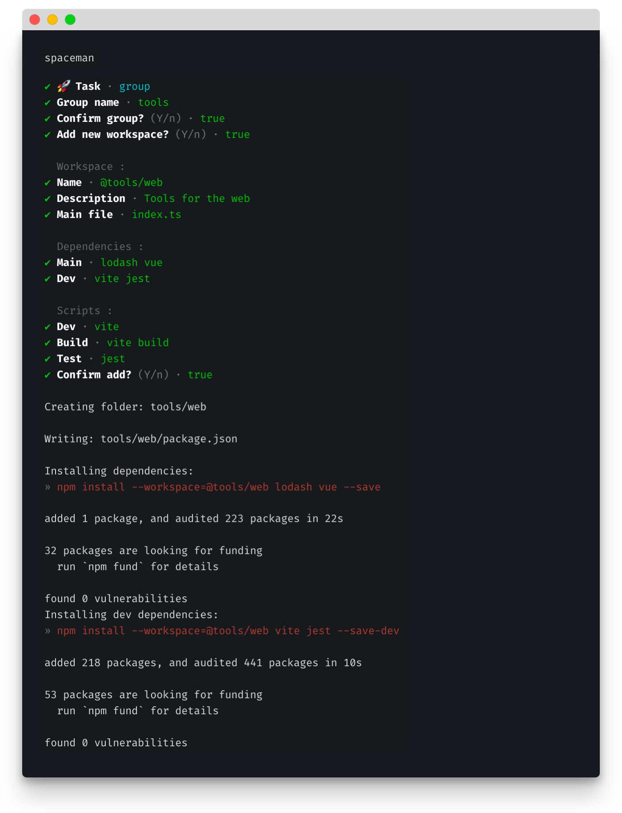
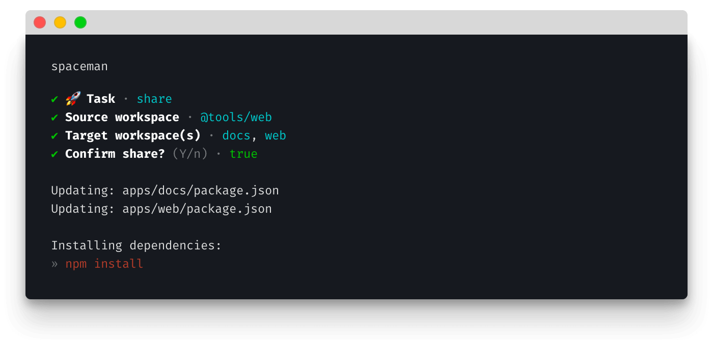

# Spaceman

## Overview

[NPM](https://docs.npmjs.com/cli/v7/using-npm/workspaces) [PNPM](https://pnpm.io/workspaces) or [Yarn](https://classic.yarnpkg.com/lang/en/docs/workspaces/) workspaces provide a streamlined workflow to manage multiple packages within a single repository, but require a certain amount of knowledge, configuration and terminal-fu for everyday tasks.

Spaceman makes running complex or multistep tasks easier by wrapping them in prompts, and batching commands on confirmation.

Why read the docs when you can just answer questions?

## Usage

Once installed, run the package by typing `spaceman` then pick the task you want to run:

For example, creating new workspaces is easy; just answer the prompts and Spaceman will create all folders, package files, stub files and install dependencies:

Once created, it's easy to share with other workspaces too; just follow the prompts:

## Tasks

Spaceman simplifies managing scripts, packages and workspaces:

**Scripts**

- [Run](https://github.com/davestewart/spaceman#run) 
  Run any root or package script

**Packages**

- [Install](https://github.com/davestewart/spaceman#install) 
  Install one or more packages to a workspace
- [Uninstall](https://github.com/davestewart/spaceman#uninstall) 
  Uninstall one or more packages from a workspace
- [Update](https://github.com/davestewart/spaceman#update) 
  Update one or more packages in a workspace
- [Reset](https://github.com/davestewart/spaceman#reset) 
  Remove all Node modules-related files in root and all workspaces, and reinstall

**Workspaces**

- [Share](https://github.com/davestewart/spaceman#share) 
  Make a workspace available for use within another workspace
- [Group](https://github.com/davestewart/spaceman#group) 
  Add a new workspace group
- [Add](https://github.com/davestewart/spaceman#add) 
  Add a new workspace
- [Remove](https://github.com/davestewart/spaceman#remove) 
  Remove an existing workspace

No more navigating folder structures and rewriting configs; Spaceman does it all from one simple CLI!

## Links

- [GitHub](https://github.com/davestewart/spaceman)
- [NPM](https://www.npmjs.com/package/spaceman)

