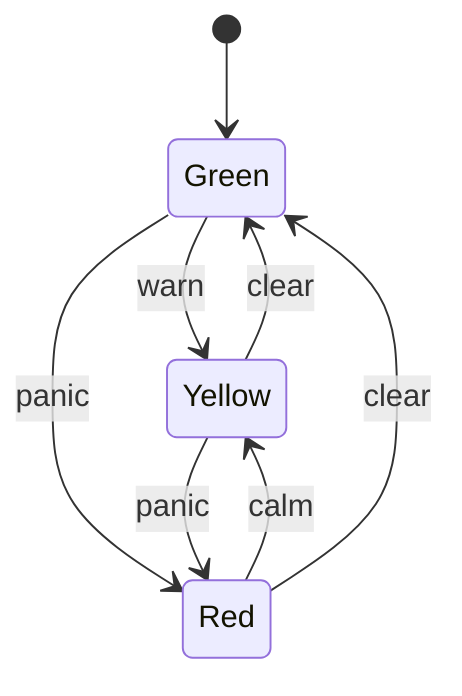

# State Machine

## Overview

State Machine is a powerful yet simply-configured state machine.

Its [intuitive](https://statemachine.netlify.app/html/api/transitions/advanced.html) [yet](https://statemachine.netlify.app/html/api/transitions/wildcards.html) [powerful](https://statemachine.netlify.app/html/api/transitions/separators.html) DSL can describe states and transitions succinctly whilst its [JavaScript API](https://statemachine.netlify.app/html/api/index.html) hooks into transitions with a rich [event syntax](https://statemachine.netlify.app/html/api/events/interactive.html) to build complex [application flows](https://statemachine.netlify.app/html/examples/index.html):

```js
const transitions = [
  'warn  : green > yellow',
  'panic : green   yellow > red',
  'calm  :         yellow < red',
  'clear : green < yellow   red'
]
```

The **interactive** demo above shows-off many of StateMachine's features. Visit the [site itself](https://statemachine.netlify.app) and view the source code directly in the page, or **open the console** here to see the application log updates as it transitions between states and fires events.

## Implementation

The library itself is built as a stand-alone library with two component parts:

- the DSL lexer and parser
- the state machine engine

The syntax of the library consists of the transition setup (text or object format) and *optional* handlers:

```js
const config = {

  transitions: [
    'warn  : green > yellow',
    'panic : green   yellow > red',
    'calm  :         yellow < red',
    'clear : green < yellow   red',
  ],

  handlers: {
    'action:end': function (event) {
      console.info(event.transition)
    },
    'red:leave': function (event, fsm) {
      console.log(event)
      fsm.pause()
      setTimeout(function () {
        fsm.resume()
      }, 1000)
    },
  },

}

const fsm = new StateMachine(config)
```

The above is the classic [traffic light](https://statemachine.netlify.app/html/examples/flows/branching.html) example, with some additional handlers to show off the API.

The library can be used standalone (as per the examples) or with helpers to power [jQuery](https://statemachine.netlify.app/html/setup/helpers/jquery.html), [Angular](https://statemachine.netlify.app/html/setup/helpers/object.html) or [Vue](https://statemachine.netlify.app/html/examples/vue/vue-router.html).

## Reflection

### At the time of writing

I built State Machine after becoming interested in state machines as a potential solution to complex user flows such as checkouts or multi-step forms.

As it happens, I've never used it in production, and it's just ended up as a cool technology investigation.

If I had the time and inclination to continue this project, the main aims would be:

- decouple the notation DSL from the core library
- add support for nested state machines

### Thoughts in 2026

 I would imagine these days if you wanted to use state machines, you would look at [X State](https://xstate.js.org/).
 
A fun next step  for this library would be enabling the DSL to build state machines for that library, however, I recently learned that Mermaid supports state diagrams, so perhaps the next step would be to build a Mermaid plugin to generate X State machines from Mermaid state diagrams:



Check out the visualisation for this state tree on [Graphlet](https://graphlet.xyz/?state=eJxljz0LwjAQhv_KkVHs4tjBSRShRbCTtB2uydkG8iFpsBTxv5u0Dq1ud89z78H7YtwKYinrPXo6SGwd6uS5qwxAuakhSfZwckSmMhFN4wRvpJQdIIUB3Y-6kgj8gUbyKL6Xfya6CFbfOCo9q0Vsfh2kInTL2EqwLfMdaTqLUEdLYWTb-QilV7HhxQlykMk78TEEgqGRGmeH4IrYHnLknTTRNCha6llasmORhz2zreSsfn8Af71fpA
).

## Links

- [statemachine.netlify.app](https://statemachine.netlify.app/)
- [GitHub](https://github.com/davestewart/javascript-state-machine)

