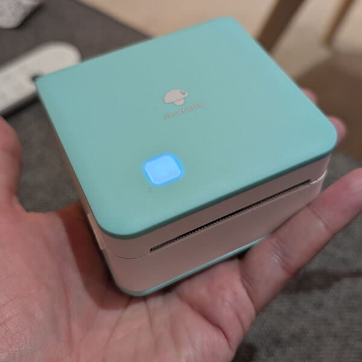
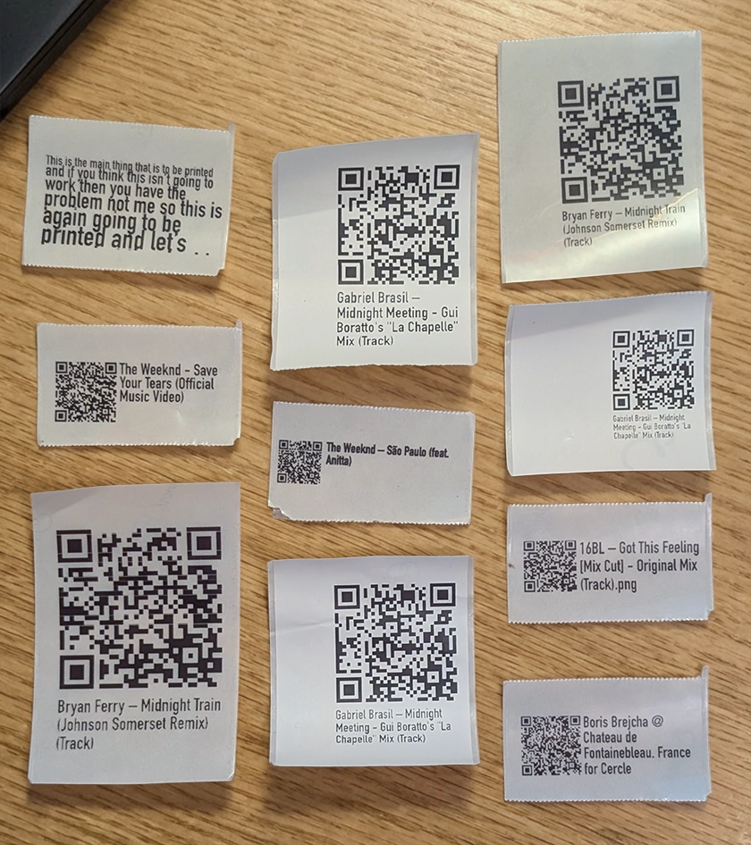
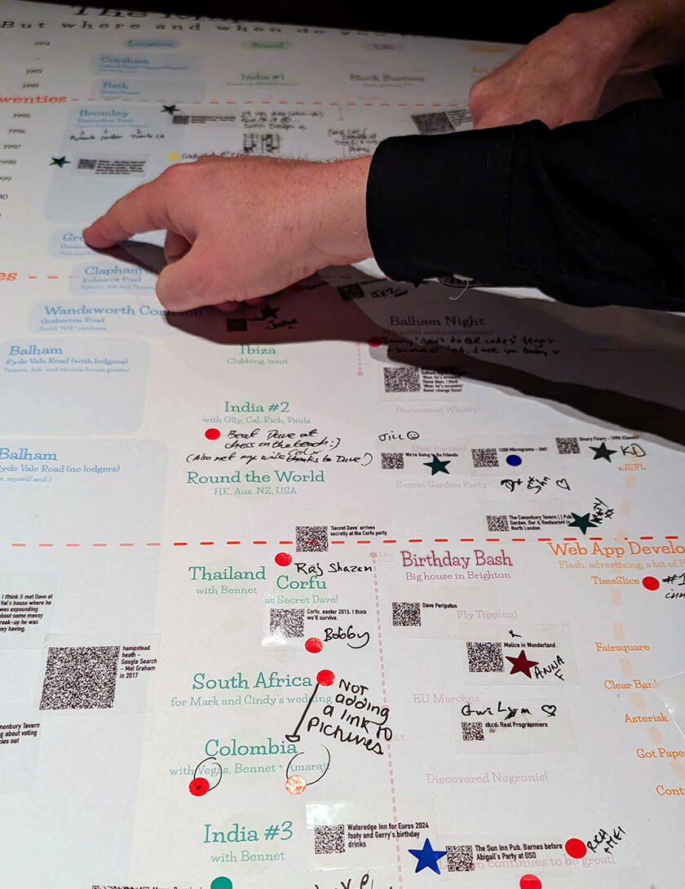

# Birthday Timeline

## Introduction

For my last couple of significant birthdays, I have tried to find ways to make the occasion more engaging for my guests who may know _me_ very well, but may never have met each other.

For my most recent birthday, I came up with the idea of a visual timeline – the **"Map of Dave"** – where folks could share **where**, **when**, but also **how** they met me. I hoped annotating of events and memories ("oh, how do you know Dave... oh, me too!") would spark conversation and deeper interaction and make everyone's day more interesting.

## Plan

I had a rough idea of the parameters for the talking points, which were:

- **when**: a vertical list of _Dates_ from teenage years until now
- **where**: a top-level list of categories; _Location_, _Travel_, _Life_ and _Career_
- **how**: _Milestones_ in my life, such as where I lived, career stage, leisure time, etc

I would design and print the timeline as a poster that people could **physically engage with**.

For the actual memories, I thought people could write on the poster, leave messages, add stickers, etc.

But then I had an idea...

:quote{text="What if guests could share links?" hero size=3}

Theen they could share facebook posts, photos, music, videos, or anything, really!

QR codes seemed like the obvious solution here, then anyone viewing the finished poster could simply hold up their phone and within a few seconds experience more than than just a handwritten message!

## Printing

A bit of research later, and I'd sourced a [Phomemo M02 Pro](https://phomemo.com/products/m02-portable-printer) which I could use to print stick-on labels:

{srcset="images/timeline-printer.jpg 600w, images/timeline-printer@2x.jpg 1200w"
sizes="(max-width: 600px) 100vw, 600px"}

Whilst it printed from a phone app I figured it would be too onerous to have people install something on their phone, so I researched a way to do custom printing from a laptop. 

As luck would have it, there was a [Node script](https://github.com/vrk/cli-phomemo-printer) on GitHub which it seemed I could use to interface with the printer.

## Kiosk

The next step was to use the existing script to build a kiosk for the event itself.

To do this, [I built](/projects/open-source/phomemo-cli/):

- a simple CLI which wrapped the original script
- a lightweight web server which could receive web requests to print
- a simple browser extension to generate QR codes and call the server 

The result was, a user could visit any website, and click a toolbar button to print a sticky label to affix to the poster:

:media-video{src="https://www.youtube.com/embed/FKt4TMi-QBY" width="1920" height="1080"}

Getting the sizes right took quite a lot of trial and error; I've now got a stack QR code stickers I can place anywhere:

::alert{icon="tip" title="Scan the screen"}
Use your phone to scan the QR codes above; this is the same way the poster works!
::

## Design

The timeline artwork was designed in Figma and printed at A1 size:

:media-gallery{media="map" scale}

I was excited to see how people would interact with it!

## On the day

One the day we set off for the host bar, myself equipped with laptop, printer, cables, poster (and spare poster!) and set it all up – a little worried that people would ignore or abandon my silly idea. 

As it happened, people loved it, and there was a literal throng of bodies round the laptop all day, ready to print all kinds of memories, from music to maps to videos to facebook posts.

Although the QR codes don't work at this resolution, they work perfectly on the poster.

## Last word

I'm not going to share the final poster here as it contains personal details I don't want on the internet, but as the `*` annotation in the footnote of the final poster says...

:Quote{text="Just be happy it’s not a damn spreadsheet&#8239;!" hero size=2}

## Links

- [Phomemo CLI](/projects/open-source/phomemo-cli/)
- [Phomemo M02 Printer](https://eu.phomemo.com/products/m02-pro-portable-printer)
