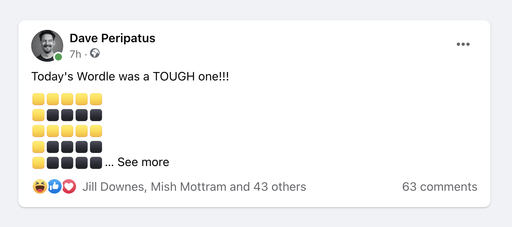
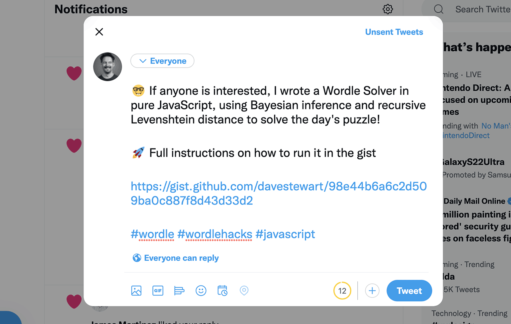

# Wordle Solver

> ### Did you arrive here by clicking on a link in your browser console!?
> 
> ***If so – read on to find out what this is all about!***

## Intro

If you've not had Wordle popping up on your Facebook timeline, Twitter feed, or wherever else it can pop up – you've likely been living under an Internet-disconnected rock for the last 9 months... and I'm jealous!

[Wordle](https://www.nytimes.com/2022/01/03/technology/wordle-word-game-creator.html) seems to have addicted half the Internet-surfing public, and aside from being mildly irritated I'm not into the fun like my friends are, my darker side has been curious to see if I can somehow annoy / amuse them, or perhaps use this viral force to my advantage.

What started out as a fun prank on my Facebook wall (you can guess where that F was going) germinated into the seed of an idea.



What if I could somehow persuade [desperate](https://www.mirror.co.uk/news/uk-news/brits-left-fuming-over-todays-26181923) Wordle users to run a bit of JavaScript that they thought would give them a sneaky, clever, and unfair advantage within the game – but instead – play a little trick on them? 



That link takes them here:

- [gist.github.com/davestewart/98e44b6a6c2d509ba0c887f8d43d33d2](https://gist.github.com/davestewart/98e44b6a6c2d509ba0c887f8d43d33d2)

And those computer science terms are real (and could potentially solve a word problem like this) but not in this case!

Is it ethical? _Not really_. Is it harmful? _I don't think so_. Is it funny? _Time will tell_.

And so the idea was born: create a piece of online code that _anyone_ could run in their browser, and the code – rather than helping them as it promised – would play a trick on them; in this case saying ***"GOTCHA"*** in the Wordle style in their devtools console.

To complete the loop the output also links to this page, so they get to "see behind the curtain" and I get to track how successful it was as an exercise.


## Preparation

### Encoding the text

The text is originally written in ASCII characters [like this](https://github.com/davestewart/davestewart-site/blob/main/content/projects/personal/wordle-solver/code/words/gotcha.txt):

```
 xxx
x   x
x    
x xxx
x   x
 xxx

 xxx
x   x
x   x
x   x
x   x
 xxx
 
xxxxx
  x
  x
...
```

However, because I needed to obfuscate its purpose, it should be encoded (using a custom algorithm):

```js
let staticText = rawText
  .replace(/^+\n|\n+$/, '')
  .replace(/ +/g, c => c.length)
  .replace(/\n/g, Math.ceil(Math.random() * 4) + 5)
  .replace(/x/g, c => String.fromCharCode(65 + Math.floor(Math.random() * 26)))
  .toUpperCase() //?
```

The encoded output looks like this:

```
1JOJ8X3Y8X48Y1SKD8T3J81YEQ881DMS8A3N8G3X8Y3U8T3E81UVR818DWUPF82M82Q82E82B82X881UOR8D3V8N8I8J3Q81WZT818S3H8F3I8MEUYV8H3D8O3G882E81T1Q8I3M8SELRG8M3R8E3Q
```

The algorithm:

1. Replaces spaces with the number of spaces (1 - 5)

   _We use this number to decode the spaces after_

2. Replaces line ends with a random number (6 - 9)
  
   _This is simply to throw the user off the pattern_

3. Replaces the `x` characters with random letters `a - z`

   _Again, this is just for obfuscation purposes_

4. Converts to result upper case

   _Simply to make it harder to spot patterns by eye_

Note that I did not want to use the browser's native `btoa()` and `btoa()` functions, as they generally have a giveaway `==` at the end of the encoded text, and would make it easy to encode. As this was going on Twitter, I wanted even other developers not to be able to decode the text quickly or easily, or the joke would be lost.

### Encoding the URL

The URL is encoded using a simpler algorithm that reverses the string and replaces punctuation with numbers – for the sole purpose to obfuscate characters that might give it away as a URL:

```js
let staticUrl = rawUrl.toUpperCase().split('').reverse().join('')
  .replace(/:/g, '0')
  .replace(/\//g, '1')
  .replace(/\./g, '2')
  .replace(/-/g, '3') //?
```

This results in:

```
REVLOS3ELDROW1LANOSREP1STCEJORP1KU2OC2TRAWETSEVAD110SPTTH
```

## The main program

The main program does 3 things:

- declares the encoded strings and helper characters
- provides decoding and rendering functions
- processes and outputs the graphics

### Declarations

The first section of the program declares the encoded strings: 

```js
// variables
let encodedText = '1JOJ8X3Y8X48Y1SKD8T3J81YEQ881DMS8A3N8G3X8Y3U8T3E81UVR818DWUPF82M82Q82E82B82X881UOR8D3V8N8I8J3Q81WZT818S3H8F3I8MEUYV8H3D8O3G882E81T1Q8I3M8SELRG8M3R8E3Q'
let encodedUrl = 'REVLOS3ELDROW1LANOSREP1STCEJORP1KU2OC2TRAWETSEVAD110SPTTH'

// graphics
let chars = ['⬛', '🟨', '🟩']
let space = String.fromCharCode(32)
```

### Helper functions

The next bit declares the decoding and rendering functions:

```js
// decoding
let decodeText = text => text
  .replace(/[1-5]/g, m => space.repeat(parseInt(m)))
  .replace(/[6-9]/g, m => '\n')

let decodeUrl = url => url.toLowerCase()
  .split('')
  .reverse()
  .map(c => /[0123]/.test(c) ? ':/.-'.charAt(parseInt(c)) : c)
  .join('')

// rendering
let index = Math.random() * 5
let toggle = c => c === space ? chars[0] : index++ % 7 > 1 ? chars[1] : chars[2]
let random = c => c === space ? chars[0] : Math.random() < .7 ? chars[1] : chars[2]
let greeen = c => c === space ? chars[0] : chars[2]
let yellow = c => c === space ? chars[0] : chars[1]
```

The decoding functions effectively reverse the steps taken to encode the original text.

There are 4 rendering algorithms, each of which outputs a different balance of colour. Depending on the platform and colour scheme, different algorithms look better. For Facebook and DevTools console, I tuned the `toggle()` algorithm to output mainly yellow squares, with occasional green ones.

### Process and output

The final piece of the main program decodes all the text, processes the lines, renders the characters, then dumps the output to the console along with this URL:

```js
// decode
let text = decodeText(encodedText)
let url = decodeUrl(encodedUrl)

// process
let wordle = text.trim()
  .split('\n')
  .map(line => line.padEnd(5).split('').map(toggle).join(''))
  .join('\n')

// output
console.log(`${wordle}\n${url}`)
```

The result of all this is what (if you've come from the link) you should have _already_ seen in the console!

## Distributing the code

The final piece of the puzzle is to [minify and uglify](https://skalman.github.io/UglifyJS-online/) the code so that at first glance it's not possible to tell what it does:

```js
a="1JOJ8X3Y8X48Y1SKD8T3J81YEQ881DMS8A3N8G3X8Y3U8T3E81UVR818DWUPF82M82Q82E82B82X881UOR8D3V8N8I8J3Q81WZT818S3H8F3I8MEUYV8H3D8O3G882E81T1Q8I3M8SELRG8M3R8E3Q",e="REVLOS3ELDROW1LANOSREP1STCEJORP1KU2OC2TRAWETSEVAD110SPTTH",r=["⬛","🟨","🟩"],n=String.fromCharCode(32),E=a=>a.replace(/[1-5]/g,a=>n.repeat(parseInt(a))).replace(/[6-9]/g,a=>"\n"),t=a=>a.toLowerCase().split("").reverse().map(a=>/[0123]/.test(a)?":/.-".charAt(parseInt(a)):a).join(""),o=5*Math.random(),p=a=>a===n?r[0]:o++%7>1?r[1]:r[2],S=a=>a===n?r[0]:Math.random()<.7?r[1]:r[2],s=a=>a===n?r[0]:r[1],R=a=>a===n?r[0]:r[2],T=E(a),O=t(e),i=T.split("\n").map(a=>a.padEnd(5).split("").map(p).join("")).join("\n");console.log(`${i}\n${O}`);
```


I then published the code as a [GitHub Gist](https://gist.github.com/davestewart/98e44b6a6c2d509ba0c887f8d43d33d2) – which is quite a common way for people to share code – and waited for the clicks to come.

_You can run this code directly in the browser's DevTools console, and it will output **"GOTCHA"** in Wordle-style letters._

## Have a go!

I've included the full code for this experiment on GitHub:

- [github.com/davestewart/davestewart-site/tree/main/content/projects/personal/wordle-solver/code](https://github.com/davestewart/davestewart-site/tree/main/content/projects/personal/wordle-solver/code)

Also, a folder with the full alphabet and some alternative words you want to jump in and start sending "fake" Wordles to your friends, family, enemies or Internet strangers.

If you want to output your own text:

1. write your words in the `rawText` variable
2. replace `var wordle = text` with `var wordle = rawText`
3. run the code

To send your own secret code you can:

1. write your words in the `rawText` variable
2. grab the `staticText` output (`console.log(staticText)`)
3. replace the `encodedText` variable content with this output
4. optionally change the renderer (replace `.map(toggle)` with `.map(yellow)` or such like)
5. run the code through [Uglifier](https://skalman.github.io/UglifyJS-online/)
6. do something with it (up to you)

The code is written in such a way that it can be run in the browser Dev Tools console, the DevTools [Snippets](https://developer.chrome.com/docs/devtools/javascript/snippets/) panel, or within your IDE using a tool like [Quokka](https://quokkajs.com/).

## Conclusion

This whole thing has been an experiment that took a few hours of my evening, and hopefully everyone has a little fun along the way.

It's too early to tell yet if the tweet will have any viral pickup, or how many people will copy / paste the code and feel like clicking the link to closing the loop. If that does happen, then it will have been worthwhile.

- if you've arrived here via the link then  [have a look around](/search/) seeing as you're here!
- if not, I hope you enjoyed the post and learnt a little along the way

Bye for now 👋
