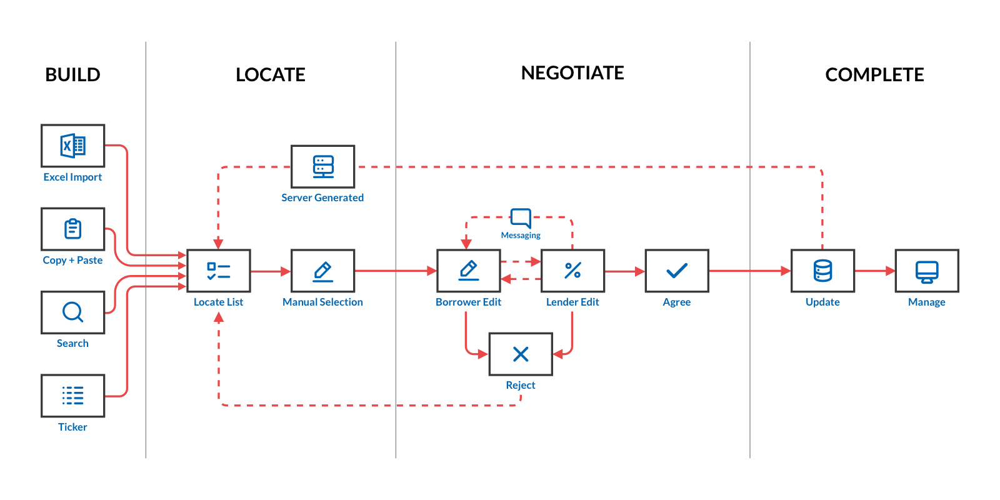
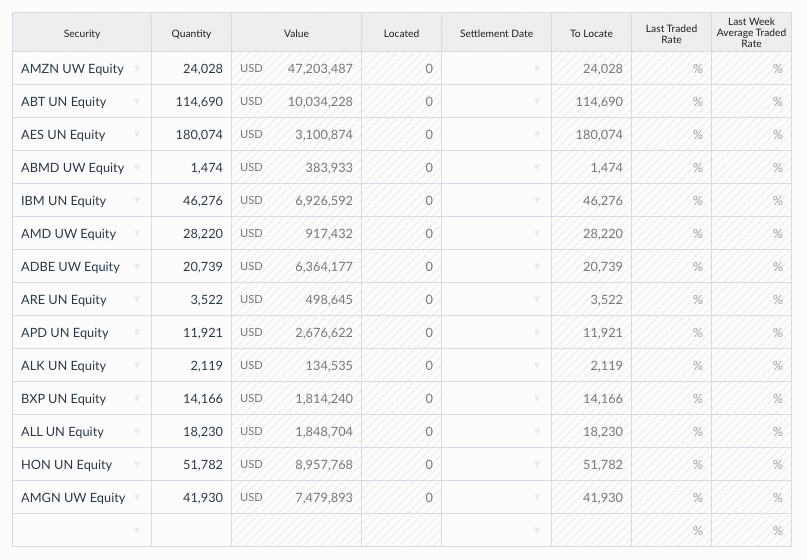
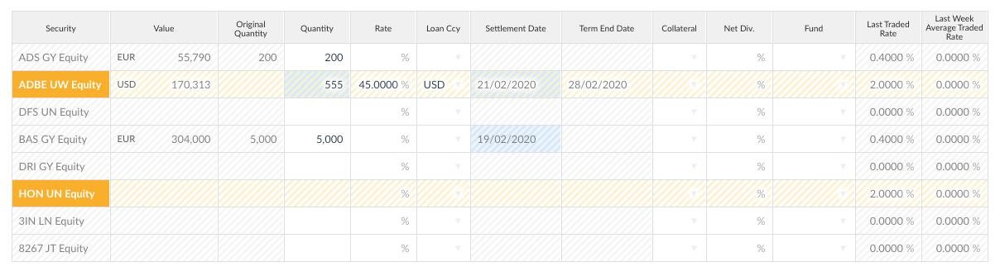
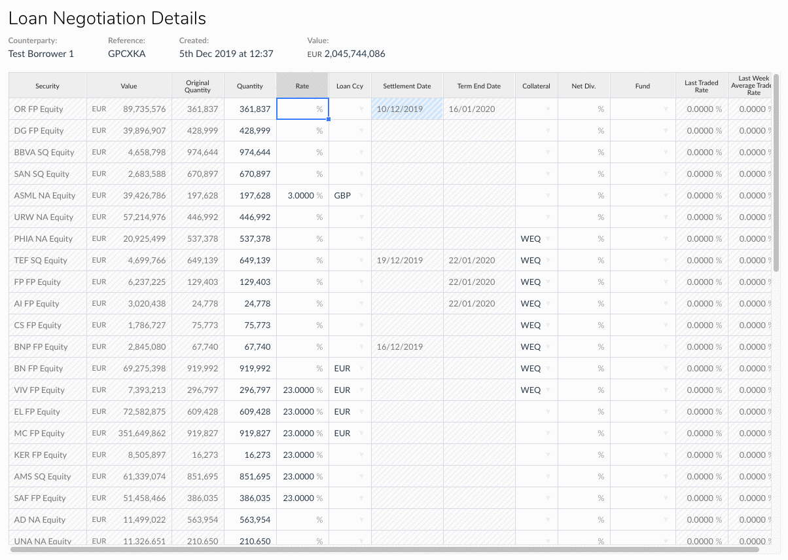
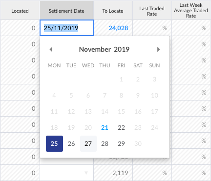
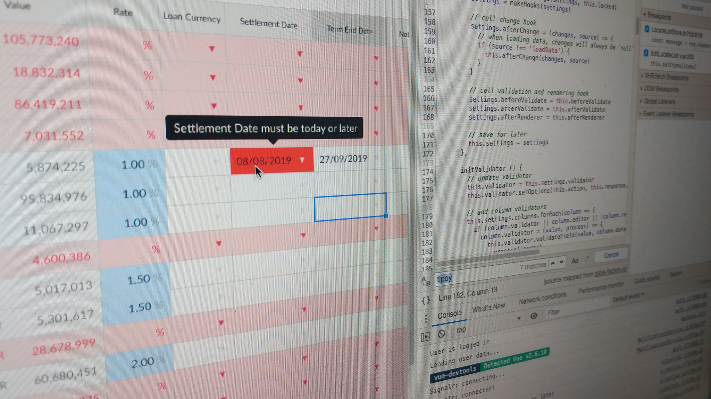

# Asterisk

## Overview

Asterisk Networks is the first fintech platform for peer-to-peer global securities lending and repo transaction negotiation.

I joined Asterisk to lead the front end design and build, architecting a robust and modular system in response to stakeholder requirements, over the course of around a year.  

## Implementation

### Tech stack

The site is a [Vue JS](https://vuejs.org/) SPA, served by a .Net REST API, and hosted on the [Azure](https://azure.microsoft.com/en-us/) Cloud. Authorisation is handled by [Auth0](https://auth0.com/) and live updates are handled by [Signal R](https://dotnet.microsoft.com/apps/aspnet/signalr). 

The application is written in [TypeScript](https://www.typescriptlang.org/) and is built using [WebPack](https://webpack.js.org/), compiling to 4 environments with programatic [CSP](https://developer.mozilla.org/en-US/docs/Web/HTTP/CSP)s for each. We use a variety of components and libraries including [Element UI](https://element.eleme.io/), [Vee Validate](https://vee-validate.logaretm.com/v3/), [Vuex](https://vuex.vuejs.org/), [Vuex Pathify](/projects/open-source/vuex-pathify), [Alias HQ](/projects/open-source/alias-hq) and [Handsontable](https://handsontable.com/).

### Core UX / UI

The essence of the platform is to connect lenders and borrowers to negotiate securities:



Borrowers generally begin negotiations by requesting lists of securities from lenders, to which lenders respond with what they have on their books. Both parties can edit the same spreadsheet (with slightly different columns and rules) with sophisticated formatting and controls to ensure each is kept updated (live!) with any changes from the other.

Negotiations have many additional constraints on them, such as user preferences, availability, "special" securities, updates from 3rd parties, even exchange closing times. Complex validation and rules designed to prevent parties making a mistake or putting the system into an unstable state are managed at both the front and back end.

Parties take it in turns to counter, accept or reject each other's offers until an agreement is reached; think email with the message content an ever-evolving spreadsheet, and you're pretty much there.

As the day passes, negotiations are moved across a kanban board from "Locate Lists" through "Requested", "Negotiating" and "Completed" columns. Cards are updated with colour-coded tags and other information including value, state and any "special" properties such as who replied last.

Once the day is complete, all negotiated items are generally cleared overnight by an external clearing house, and are then stored in the system as loans, which in turn can be queried, returned, recalled or rerated... which trigger new sub-negotiations pertaining to those tasks.

## Highlights

In an application of this size, there are many other systems, such as authentication, user management, state management, async data, error handling, dynamic routing, notifications, security, component design, build system, etc etc, but here are a few interesting highlights.

### Handsontable

The star of the show of this app is our Handontable implementation.

We use a system of column factories to generate the column definitions, in conjunction with various custom cell renders, cell editors:



The data that goes into through the table is managed by a bespoke Handsontable wrapper that ensures one-way data flow, keeps track of changes, and marshals validation and errors.

All these states, editors and renderers have sophisticated formatting and styling constraints that need to work with one another, and clearly indicate to the user what state any negotiation item is in:



Additional tools such as right click menus allow us to provide tools to our users to make the process of negotiating securities intuitive and less prone to mistakes:



Additionally, all cells and controls were tweaked to match our overall application formatting, which is designed around our Element UI component set: 



### Vee Validate

We used Vee Validate to validate every single human input that goes into our tables.

This allows us to pair validation rules with column definitions, and pass in complex rules which can in turn be tracked and called by the table class:   



Working with data in this way led to deep understanding of the Vee Validate library, resulting in several pull requests, including one to provide an intuitive [new way](https://github.com/logaretm/vee-validate/pull/2443) to do [cross-field validation](https://vee-validate.logaretm.com/v3/advanced/cross-field-validation.html#target-fields-names):

```js
const values = { value: 20, maxValue: 15 };
const names = { value: 'Value', maxValue: 'Max Value' };
const rules = 'between:0,@maxValue';
```

### Modular build

A modular build powered by a custom WebPack setup and AliasHQ allows domain-specific functionality to be developed in isolation and stitched together at build time:

```
+- src
    +- app
    +- areas
    +- core
    +- modules
    		+- ...
        +- negotiations
        |   +- ...
        |
        +- notifications
        |   +- components
        |   +- enums
        |   +- models
        |   +- pages
        |   +- routing
        |   +- services
        |   +- state
        |   +- index.ts					<- exports local services, etc
        |   +- main.ts					<- sets up routes, store, etc
        |
        +- organisations
        |   +- ...
        +- reports
        |   +- ...
        +- ...
```

This made working on any particular unit simple:

- aliases prevent brittle paths
- the `main` file allows individual modules to be instantiated
- the `index` exports members so modules may borrow functionality from each other

## Links

- [Asterisk Networks](https://asterisknetworks.com)
- [Handsontable - Asterisk Networks Case Study](https://handsontable.com/customers/asterisknetworks/)
- [Vuex Pathify](/projects/open-source/vuex-pathify)
- [Alias HQ](/projects/open-source/alias-hq)

