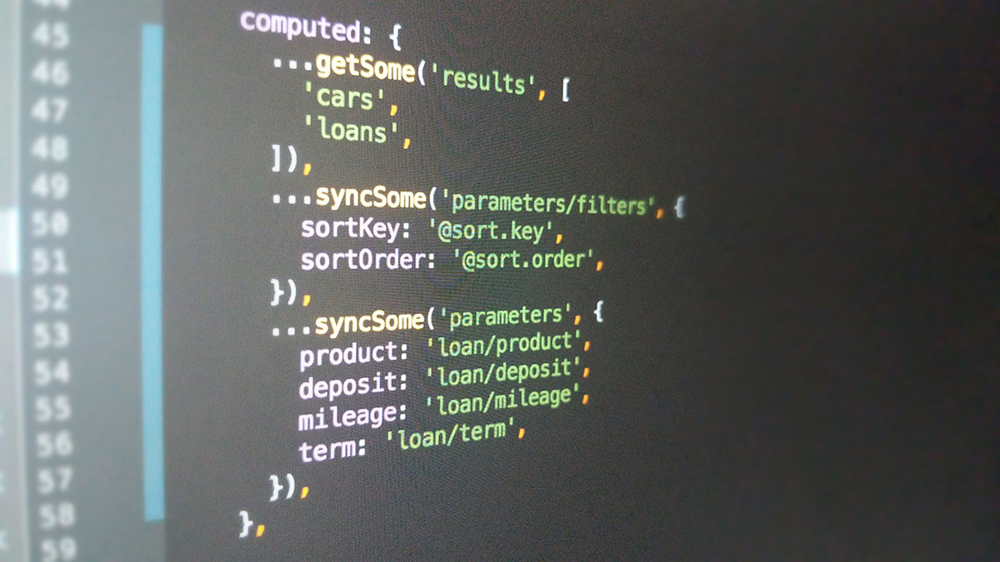

# FairSquare

## Overview

FairSquare is an online-only car financing and sales platform.

It allows people of any credit rating to buy a car on credit, using live credit rating algorithms to tailor the best offer for the individual, from a range of lenders, and provide the cars to be sold from a catalogue of nationwide UK dealerships.  

I lead a small team to work directly with the stakeholders and build-out a greenfield platform. The project lasted about 9 months, and we covered every aspect of a large site build, from front end to backend, from UX flows to database optimisation, from component libraries to Worldpay integration, from SEO to regulatory requirements.

## Detail

### Business requirements

FairSquare is a big, complex proposition, with a number of years' work before it got to us.

We were tasked with both understanding the current business and larger vision, as well as taking a small proof of concept based around auctions and live bidding, and extrapolating and building on that to create a much larger site.

There would ultimately be various ways for a customer to browse and purchase a vehicle; either brand new or previously-owned, requiring the team to wrap their understand the mechanics behind various car finance credit models such as PCP and HP so we could clearly guide customers to well-informed purchase decisions.

### Working practices

We worked as a small in-house design and development team at [Gravity Global](https://gravityglobal.com/) with weekly meetings with stakeholders where we presented progress, received feedback, and ideated on subsequent work.

We also worked closely with an off-shore team who were developing (one of) the back end(s).

Later in the project our small team merged with the client's strategic and technical leads in an off-site location (a lovely [We Work](https://www.wework.com/en-GB/buildings/moor-place--london), thank you!) to collaborate more closely and deliver the final phases of the project, expanding with additional freelancer resource to deliver to demanding go-live deadlines.

### UX

This project was lead by core user journeys, and we began by planning and prototyping low-fi UX flows in collaboration with stakeholders to ensure we understood their requirements and were going in the right direction:

<MediaGallery media="ux" />

Having understood the brief, we iterated on increasingly accurate fidelities of wireframes to realise user journeys on paper, before building any significant parts of the site:

<MediaGallery media="wireframes" />

There were multiple, complex sections and flows to be researched, planned, designed and built; from the browsing and financial journeys (integrating with multiple 3rd parties) to the credit checking, user account, purchase, and delivery journeys. 

Because the client was effectively a start-up, this collaborative process helped them to understand their own ideas as we reviewed new mockups and designs together.

### Technical

The technical side of the project ran in tandem with the UX and design, almost from the start.

Being a nine-month project, there were myriad technical challenges to surmount, including but not limited to:

- understanding and refactoring the original POC supplied by the client
- architecting the overall frontend build
- state management challenges around complex search requirements 
- a huge amount of forms and form validation
- building and maintaining an ever-expanding component library
- integration with the backend and 3rd-party financial services
- customer account, checkout, delivery and Worldpay payment flow
- specific backend refactoring and database optimisation tasks
- additional regulatory requirements around handling sensitive credit data
- and the list goes on, and on, and on...

The application itself is a [Vue 2](https://vuejs.org/) and [Vuex](https://vuex.vuejs.org/) build, with [Semantic UI](https://semantic-ui.com/) as the UI framework. Had Nuxt been an option (it [wasn't even in](https://www.npmjs.com/package/nuxt/v/0.10.7) alpha when we started) we would have gone down that route.

Interestingly the project's heavy use of Vuex lead to the development of a [state management solution](https://github.com/vuejs/vuex/issues/866#issuecomment-344892845) which would ultimately become [Vuex Pathify](/projects/open-source/vuex-pathify/):

We also used [Laravel Sketchpad](/archive/projects/tools/laravel-sketchpad/) to set up and run local database tools and queries.

## Links

- [FairSquare](https://fairsquare.com)
- [Vuex Pathify](/projects/open-source/vuex-pathify/)

