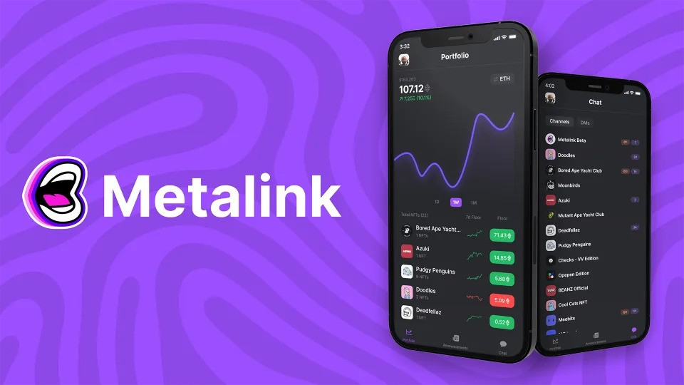

# Metalink

## Overview

Metalink was a [Web3](https://ethereum.org/en/web3/) startup operating in the [NFT](https://www.theverge.com/22310188/nft-explainer-what-is-blockchain-crypto-art-faq) space.

Their main product was a web app that enables NFT owners to keep their finger on the NFT pulse with floor price tracking, portfolio valuation, in app chat, announcements and more.

## Work

I joined Metalink to work on their reasonably mature Vue app (built primarily by React developers using Ant Fu's [Vitesse](https://github.com/antfu/vitesse) framework) with a remit to bring my deep Vue and architectural knowledge to scale the product could scale going forwards.

The work was split between refactoring, prototyping, feature development including close to real-time charting of portfolio data, error correction, cross-platform (Vue 3 and React Native) caching and rendering techniques, a little React Native / Recoil development, as well as supporting and mentoring our small frontend team.   

## Outcome

It was an interesting almost-year with MetaLink, getting to know NFTs, the Web 3 and Blockchain world, learn a little about smart contracts, NFT speculation, HODL, and the "we're all gonna make it" spirit.

Ultimately, it seems that AI ate NFTs' lunch, and the attention shifted elsewhere, but it was a great experience working with a varied, remote team with vision, funding and lofty goals.  

## Links

- [Metalink](https://finance.yahoo.com/news/vc-backed-nft-social-platform-140000455.html)
- [Twitter](https://twitter.com/metalinklabs)
- [App Store](https://apps.apple.com/us/app/metalink/id1614757016)
